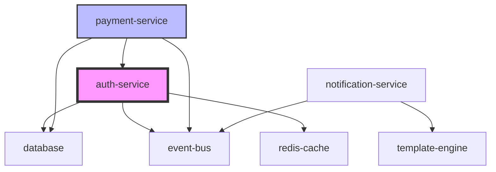

# 🎯 Vibe Skills - AI 주도 개발 방법론

[](https://code.claude.com)
[](https://opensource.org/licenses/MIT)
[](https://github.com/NewTurn2017/vibe-skills)

**Vibe Coding**은 AI와 개발자가 협업하는 체계적인 개발 방법론입니다. 계획과 실행을 명확히 분리하여 개발자가 아키텍처 주도권을 유지하면서 AI의 생산성을 극대화합니다.

## 📋 목차

- [핵심 철학](#-핵심-철학)
- [설치 방법](#-설치-방법)
- [사전 요구사항](#-사전-요구사항)
- [4단계 워크플로우](#-4단계-워크플로우)
  - [1. vibe-research (리서치)](#1-vibe-research---심층-리서치)
  - [2. vibe-plan (계획)](#2-vibe-plan---구현-계획)
  - [3. vibe-implement (구현)](#3-vibe-implement---기계적-구현)
  - [4. vibe-review (리뷰)](#4-vibe-review---자동-코드-리뷰)
- [Team Mode (NEW v2.1)](#-team-mode-new-v21)
- [사용 예제](#-사용-예제)
- [고급 기능](#-고급-기능)
- [FAQ](#-faq)
- [기여하기](#-기여하기)

## 🧠 Smart Mode (NEW v2.1)

**이제 옵션을 명시하지 않아도 됩니다!** 자연어로 요청하면 AI가 의도를 파악하여 자동으로 필요한 분석을 수행합니다.

### 기존 방식 vs Smart Mode

| 기존 방식 (v2.0) | Smart Mode (v2.1) |
|-----------------|-------------------|
| `/vibe-research "성능" --deep --graph` | `/vibe-research "로그인이 느려요"` |
| 옵션을 알아야 함 | 자연어로 표현 |
| 명시적 지정 필요 | AI가 자동 판단 |
| 학습 곡선 있음 | 즉시 사용 가능 |

### 작동 예시

```bash
# "느려요" → --deep (성능 분석) 자동 선택
/vibe-research "로그인이 왜 이렇게 느려?"

# "정리" → --patterns (코드 품질) 자동 선택  
/vibe-research "이 코드 좀 정리해야 할 것 같아"

# "전체" → 모든 옵션 자동 선택
/vibe-research "결제 모듈 전체적으로 분석해줘"
```

### Smart Mode 신뢰도 시스템

- **90% 이상**: 자동 실행
- **70-90%**: 간단 확인 후 실행
- **70% 미만**: 사용자에게 선택지 제공

자세한 내용은 [Smart Mode 가이드](#smart-mode-상세-가이드)를 참조하세요.

## 🌟 핵심 철학

### 왜 Vibe Coding인가?

1. **의사결정과 실행의 분리**: 개발자가 "무엇을" 만들지 결정하고, AI가 "어떻게" 구현할지 실행
2. **문서 기반 개발**: 모든 분석과 계획을 `.vibe/` 디렉토리에 문서화하여 지식 축적
3. **점진적 검증**: 각 단계마다 검증 게이트를 두어 품질 보장
4. **롤백 가능한 구현**: 체크포인트 기반으로 언제든 안전하게 되돌리기 가능

### 기존 방법론과의 차이

| 기존 방식 | Vibe Coding |
|-----------|-------------|
| AI가 즉시 코드 작성 | 리서치 → 계획 → 승인 → 구현 |
| 일회성 대화로 지식 소멸 | `.vibe/` 문서로 지식 영구 보존 |
| 오류 발생 시 전체 롤백 | 체크포인트 기반 부분 롤백 |
| 개발자가 AI 출력물 수정 | 개발자가 계획 승인 후 AI 실행 |

## 📦 설치 방법

### Claude Code 플러그인으로 설치 (권장)

```bash
# Claude Code에서 실행
/plugin install vibe-skills
```

### 수동 설치

```bash
# 1. 저장소 클론
git clone https://github.com/NewTurn2017/vibe-skills.git ~/.claude/plugins/vibe-skills

# 2. 스킬 설치
cd ~/.claude/plugins/vibe-skills
./install.sh

# 3. Claude Code 재시작
```

### 설치 확인

```bash
# Claude Code에서 다음 명령어로 확인
/vibe-research --help
```

## 📌 사전 요구사항

### 기본 (Single Mode)

별도 의존성 없이 바로 사용 가능합니다.

아래 CLI 도구들이 설치되어 있으면 더 정확한 분석이 가능합니다 (선택사항):

| 도구 | 용도 | 설치 |
|------|------|------|
| [ripgrep](https://github.com/BurntSushi/ripgrep) (`rg`) | 고속 텍스트 검색 | `brew install ripgrep` |
| [fd](https://github.com/sharkdp/fd) | 파일 탐색 | `brew install fd` |
| [ast-grep](https://github.com/ast-grep/ast-grep) (`sg`) | 구조적 코드 패턴 검색 | `brew install ast-grep` |
| [tokei](https://github.com/XAMPPRocky/tokei) | 코드 통계 | `brew install tokei` |

### Team Mode (병렬 에이전트 실행)

Team Mode는 [oh-my-claudecode (omc)](https://github.com/nicobailey-omc/oh-my-claudecode) 플러그인의 에이전트 인프라를 사용합니다.

**필수:**
- [oh-my-claudecode](https://github.com/nicobailey-omc/oh-my-claudecode) — omc 플러그인 설치 및 설정 완료
  ```bash
  # omc 설치 (Claude Code에서)
  /install-plugin oh-my-claudecode
  ```

**사용되는 omc 에이전트:**

| 에이전트 | 모델 | 역할 |
|---------|------|------|
| `explore` | haiku | 코드베이스 구조 탐색 |
| `analyst` | opus | 성능/패턴 분석 |
| `architect` | opus | 아키텍처/의존성 분석 |
| `planner` | opus | 구현 전략 수립 |
| `critic` | opus | 계획 도전/리스크 분석 |
| `executor` | sonnet | 코드 구현 |
| `designer` | sonnet | UI 컴포넌트 작업 |
| `test-engineer` | sonnet | 테스트 작성 |
| `code-reviewer` | opus | 코드 품질 리뷰 |
| `security-reviewer` | sonnet | 보안 취약점 스캔 |
| `verifier` | sonnet | 테스트/빌드 검증 |

> **Note**: omc가 설치되지 않은 환경에서는 Team Mode가 비활성화되고 기존 Single Mode로 동작합니다.

## 🔄 4단계 워크플로우

### 1. vibe-research - 심층 리서치

코드를 작성하지 않고 코드베이스를 깊이 분석하여 재사용 가능한 문서를 생성합니다.

#### 기본 사용법

```bash
/vibe-research "인증 시스템 분석"
```

#### 상세 옵션

| 옵션 | 설명 | 예시 |
|------|------|------|
| `--deep` | 성능 프로파일링, 메모리 분석, Big O 복잡도 포함 | `/vibe-research "API 성능" --deep` |
| `--patterns` | 코드 패턴, 안티패턴, 중복 코드 감지 | `/vibe-research "리팩토링 대상" --patterns` |
| `--graph` | 의존성 그래프, 순환 참조 시각화 (mermaid) | `/vibe-research "모듈 구조" --graph` |

#### --deep 옵션 상세

```bash
/vibe-research "결제 시스템" --deep
```

**분석 내용:**
- **Big O 복잡도**: 각 함수의 시간/공간 복잡도 계산
- **메모리 프로파일**: 메모리 누수 가능성 지점 감지
- **성능 병목**: N+1 쿼리, 불필요한 리렌더링 감지
- **최적화 기회**: 캐싱 가능 지점, 알고리즘 개선 제안

**출력 예시:**
```markdown
## 6. 성능 분석

### 6.1 복잡도
| 함수 | 시간 복잡도 | 공간 복잡도 | 최적화 가능 |
|------|------------|------------|-------------|
| validatePayment | O(n²) | O(n) | Yes - HashMap 사용시 O(n) |
| processRefund | O(n log n) | O(1) | No |

### 6.2 메모리 프로파일
- 잠재적 누수: PaymentService의 eventListeners 미해제
- 대량 메모리 사용: transaction 배열 전체 로드 (평균 5MB)
```

#### --patterns 옵션 상세

```bash
/vibe-research "컴포넌트 구조" --patterns
```

**분석 내용:**
- **코드 중복**: 유사 패턴 감지 및 통합 제안
- **안티패턴**: God Object, Spaghetti Code 등 감지
- **베스트 프랙티스**: SOLID 원칙 준수 여부
- **리팩토링 기회**: 추출 가능한 공통 로직 식별

**출력 예시:**
```markdown
## 5. 코드 패턴 분석

### 5.1 발견된 패턴
| 패턴 | 위치 | 빈도 | 권장사항 |
|------|------|------|----------|
| try-catch 없는 async | 12개 파일 | 45회 | 공통 에러 핸들러 추가 |
| console.log 디버깅 | 8개 파일 | 23회 | 프로덕션 제거 필요 |
| any 타입 사용 | 5개 파일 | 15회 | 구체적 타입 정의 |

### 5.2 중복 코드
```typescript
// 3개 파일에서 유사한 validation 로직 발견
// 공통 유틸로 추출 권장
validateEmail() // auth/login.ts:45
validateUserEmail() // user/profile.ts:89  
checkEmailValid() // api/register.ts:123
```
```

#### --graph 옵션 상세

```bash
/vibe-research "마이크로서비스 구조" --graph
```

**분석 내용:**
- **모듈 의존성**: 각 모듈 간 import/export 관계
- **순환 참조**: 순환 의존성 감지 및 해결 방안
- **결합도 분석**: 모듈 간 결합도 측정
- **영향 범위**: 변경 시 영향받는 모듈 시각화

**출력 예시:**
```markdown
## 4. 의존성 그래프

### 4.1 모듈 의존성


### 4.2 순환 참조 감지
⚠️ 순환 참조 발견:
- user-service ↔ auth-service
- 해결방안: 이벤트 기반 통신으로 분리
```

#### 산출물 예시

모든 리서치는 `.vibe/NNN_topic_research.md` 형식으로 저장됩니다:

```markdown
# Research: 인증 시스템 분석

**생성일**: 2024-03-15 14:30
**인덱스**: 001
**상태**: research-only (코드 변경 없음)
**분석 모드**: deep, patterns, graph
**태그**: #auth #security #refactoring

## 🔗 관련 리서치
- [002_database_optimization.md](002_database_optimization.md)
- [005_api_gateway.md](005_api_gateway.md)

## 1. 관련 파일/함수/타입 맵
[상세 내용...]

## 2. 현재 동작 플로우
[시퀀스 다이어그램...]

## 3. 데이터 플로우
[데이터 흐름도...]

[... 계속 ...]
```

### 2. vibe-plan - 구현 계획

리서치를 기반으로 상세 구현 계획을 수립하고 AI 리뷰를 수행합니다.

#### 기본 사용법

```bash
/vibe-plan  # 최신 리서치 기반
```

#### 상세 옵션

| 옵션 | 설명 | 예시 |
|------|------|------|
| `--research <file>` | 특정 리서치 파일 지정 | `/vibe-plan --research 002_auth.md` |
| `--feedback` | 기존 plan의 인라인 메모 반영 | `/vibe-plan --feedback` |
| `--review` | AI 기반 계획 완성도 평가 | `/vibe-plan --review` |
| `--risk-analysis` | 상세 리스크 분석 및 시뮬레이션 | `/vibe-plan --risk-analysis` |

#### --review 옵션 상세

```bash
/vibe-plan --review
```

**AI 리뷰 내용:**
- **완성도 점수**: 0-100점 기준 평가
- **누락 요소**: 보안, 성능, 테스트 등 빠진 부분
- **개선 제안**: 구체적인 개선 방향 제시
- **대안 접근법**: 다른 구현 방식 제안

**출력 예시:**
```yaml
AI Review Report:
  완성도 점수: 85/100
  
  누락 요소:
    - 보안: Rate limiting 계획 없음
    - 성능: 캐싱 전략 미정의
    - 테스트: E2E 테스트 계획 부족
  
  강점:
    - 명확한 구현 순서
    - 상세한 롤백 전략
    - 리스크 분석 우수
  
  개선 제안:
    1. API 엔드포인트별 rate limit 정의
    2. Redis 캐싱 레이어 추가
    3. Critical path E2E 시나리오 추가
```

#### --risk-analysis 옵션 상세

```bash
/vibe-plan --risk-analysis
```

**리스크 분석 내용:**
- **리스크 매트릭스**: 확률 × 영향도 계산
- **시뮬레이션**: 최선/최악 시나리오
- **완화 전략**: 각 리스크별 대응 방안
- **컨틴전시 플랜**: Plan A/B/C 수립

**출력 예시:**
```markdown
## 9. 리스크 분석

### 9.1 리스크 매트릭스
| 리스크 | 확률 | 영향도 | 레벨 | 완화 전략 |
|--------|------|--------|------|----------|
| 성능 저하 | 40% | High | 🔴 Critical | 점진적 롤아웃, 카나리 배포 |
| 데이터 손실 | 5% | Critical | 🟡 High | 백업, 트랜잭션, 롤백 스크립트 |
| 호환성 이슈 | 30% | Medium | 🟡 Medium | 충분한 테스트, 피처 플래그 |

### 9.2 시나리오 시뮬레이션
- **최선**: 2일 내 완료, 성능 30% 개선
- **현실적**: 3일 소요, 성능 15% 개선, 마이너 버그 2-3개
- **최악**: 5일 지연, 롤백 필요, 데이터 마이그레이션 실패

### 9.3 리스크 점수
총 리스크 점수: 7.2/10 (High)
진행 가능 여부: ⚠️ 추가 검토 필요
```

#### --feedback 옵션 상세

```bash
# 개발자가 plan.md에 코멘트 추가 후
/vibe-plan --feedback
```

**피드백 처리:**
- plan.md 내 `<!-- MEMO: 개발자 코멘트 -->` 추출
- 각 코멘트 반영하여 계획 업데이트
- 변경 사항 하이라이트
- 재승인 필요 항목 표시

### 3. vibe-implement - 기계적 구현

승인된 계획을 기반으로 코드를 구현하고 실시간 검증을 수행합니다.

#### 기본 사용법

```bash
/vibe-implement  # 최신 승인된 plan 실행
```

#### 상세 옵션

| 옵션 | 설명 | 예시 |
|------|------|------|
| `--plan <file>` | 특정 plan 파일 지정 | `/vibe-implement --plan 003_auth_plan.md` |
| `--parallel` | 병렬 실행 모드 (의존성 분석) | `/vibe-implement --parallel` |
| `--watch` | 파일 변경 감지 및 자동 재구현 | `/vibe-implement --watch` |
| `--rollback-on-fail` | 실패 시 자동 롤백 | `/vibe-implement --rollback-on-fail` |
| `--dry-run` | 실제 변경 없이 시뮬레이션 | `/vibe-implement --dry-run` |

#### --parallel 옵션 상세

```bash
/vibe-implement --parallel --max-workers=4
```

**병렬 실행 전략:**
1. **의존성 분석**: 파일 간 import/export 관계 파악
2. **그룹 분류**: 독립적으로 실행 가능한 파일 그룹화
3. **병렬 실행**: 각 그룹을 동시에 구현
4. **동기화**: 의존성 있는 그룹은 순차 실행

**실행 예시:**
```
🔀 병렬 실행 계획:

Group 1 (병렬 가능): 
  → types/*.ts (4 workers)
  → constants/*.ts (2 workers)
  → config/*.ts (2 workers)
  
Group 2 (Group 1 완료 후):
  → utils/*.ts (3 workers)
  → lib/*.ts (3 workers)
  
Group 3 (Group 2 완료 후):
  → services/*.ts (2 workers)
  → api/*.ts (2 workers)

예상 시간: 
- 순차 실행: 45분
- 병렬 실행: 15분 (67% 단축)
```

#### --watch 옵션 상세

```bash
/vibe-implement --watch
```

**실시간 모니터링:**
- **타입체크**: 저장 시마다 자동 실행
- **린트**: 파일 변경 감지 시 검사
- **테스트**: 관련 테스트만 자동 실행
- **번들링**: 증분 빌드로 빠른 피드백

**대시보드 출력:**
```
━━━━━━━━━━━━━━━━━━━━━━━━━━━━━━━━━━━━━
 VIBE IMPLEMENT - WATCH MODE     [14:35:22]
━━━━━━━━━━━━━━━━━━━━━━━━━━━━━━━━━━━━━
📊 Progress: ████████░░ 8/10 files

🔄 Watching:
  src/**/*.ts, src/**/*.tsx
  
⚡ Live Status:
  TypeCheck: ✅ 0 errors [14:35:20]
  Lint:      ⚠️ 2 warnings [14:35:21]  
  Tests:     ✅ 45/45 pass [14:35:22]
  Build:     🔄 Building... [2.3s]

📝 Recent Changes:
  14:35:18 - auth/login.ts (saved)
  14:35:20 - auth/session.ts (saved)
  14:35:22 - api/routes.ts (editing...)
━━━━━━━━━━━━━━━━━━━━━━━━━━━━━━━━━━━━━
```

#### --rollback-on-fail 옵션 상세

```bash
/vibe-implement --rollback-on-fail
```

**롤백 트리거:**
- 빌드 실패 → 즉시 롤백
- 테스트 실패율 > 10% → 자동 롤백
- 타입 에러 > 5개 → 롤백 제안
- 성능 저하 > 20% → 롤백 확인

**체크포인트 관리:**
```bash
# 자동 생성되는 체크포인트
vibe-checkpoint-0: 구현 시작 전
vibe-checkpoint-1: Group 1 완료
vibe-checkpoint-2: Group 2 완료
vibe-checkpoint-3: 테스트 통과
vibe-checkpoint-final: 구현 완료

# 롤백 시
🚨 테스트 실패율 15% 감지
↩️ vibe-checkpoint-2로 롤백 중...
✅ 롤백 완료 (12초 소요)
```

### 4. vibe-review - 자동 코드 리뷰

구현된 코드를 다각도로 분석하고 개선점을 제안합니다.

#### 기본 사용법

```bash
/vibe-review  # 현재 브랜치 리뷰
```

#### 상세 옵션

| 옵션 | 설명 | 예시 |
|------|------|------|
| `--branch <name>` | 특정 브랜치 리뷰 | `/vibe-review --branch feature/auth` |
| `--focus <area>` | 특정 영역 집중 리뷰 | `/vibe-review --focus security` |
| `--pr-ready` | PR 생성용 리포트 생성 | `/vibe-review --pr-ready` |
| `--auto-fix` | 자동 수정 가능한 이슈 처리 | `/vibe-review --auto-fix` |
| `--strict` | 엄격한 기준 적용 | `/vibe-review --strict` |

#### --focus 옵션 상세

```bash
/vibe-review --focus security
```

**집중 영역별 분석:**

| Focus | 분석 내용 |
|-------|-----------|
| `security` | OWASP Top 10, 인증/인가, 데이터 보호, 의존성 취약점 |
| `performance` | 시간/공간 복잡도, 메모리 누수, 캐싱 기회, 번들 최적화 |
| `accessibility` | WCAG 2.1 준수, 키보드 네비게이션, 스크린 리더 지원 |
| `testing` | 커버리지, 테스트 품질, 엣지 케이스, 목킹 적절성 |
| `architecture` | SOLID 원칙, 디자인 패턴, 모듈화, 의존성 관리 |

**Security Focus 출력 예시:**
```markdown
## 🔒 Security Deep Dive

### Critical Findings (2)
1. **SQL Injection Vulnerability**
   - Location: api/search.ts:45
   - Severity: Critical
   - CWE: CWE-89
   ```typescript
   // VULNERABLE CODE
   const query = `SELECT * FROM users WHERE name = '${userName}'`;
   
   // SECURE FIX
   const query = 'SELECT * FROM users WHERE name = ?';
   db.query(query, [userName]);
   ```

2. **Hardcoded Credentials**
   - Location: config/database.ts:12
   - Severity: Critical
   - Fix: Use environment variables

### OWASP Top 10 Checklist
✅ A01:2021 - Broken Access Control: PASS
❌ A02:2021 - Cryptographic Failures: 2 issues
✅ A03:2021 - Injection: FIXED
⚠️ A04:2021 - Insecure Design: Review needed
[...]
```

#### --pr-ready 옵션 상세

```bash
/vibe-review --pr-ready
```

**PR 문서 생성:**
- GitHub PR 템플릿 자동 생성
- 커밋 메시지 제안
- 체인지로그 항목 작성
- 리뷰어를 위한 가이드

**출력 파일:**
```markdown
# .vibe/pr-template.md

## 🎯 Summary
인증 시스템을 JWT 기반으로 리팩토링하여 보안과 성능을 개선했습니다.

## 📋 Changes
- ✅ JWT 기반 인증으로 마이그레이션
- ✅ Rate limiting 구현 (100 req/min)
- ✅ 입력 검증 강화 (XSS, SQL Injection 방어)
- ✅ 테스트 커버리지 78% (+15%)

## 🔍 Review Guide
다음 부분을 중점적으로 리뷰해 주세요:
1. `auth/jwt.ts` - 토큰 생성/검증 로직
2. `middleware/rateLimit.ts` - Rate limiting 설정
3. `validators/input.ts` - 입력 검증 규칙

## 📊 Metrics
- **Performance**: LCP 1.2s (-0.3s) ✅
- **Bundle Size**: 234KB (-12KB) ✅
- **Type Coverage**: 100% ✅
- **Test Coverage**: 78% (+15%) ✅

## ⚠️ Breaking Changes
- `POST /api/login` 응답 형식 변경
- 세션 기반 인증 → JWT 토큰 마이그레이션 필요

## 🧪 Testing
```bash
npm test           # 유닛 테스트
npm run test:e2e   # E2E 테스트
npm run test:perf  # 성능 테스트
```

## 📝 Checklist
- [x] 코드 리뷰 완료 (AI Assistant)
- [x] 테스트 통과
- [x] 문서 업데이트
- [ ] QA 팀 검증
- [ ] 프로덕션 배포 계획
```

#### --auto-fix 옵션 상세

```bash
/vibe-review --auto-fix
```

**자동 수정 가능 항목:**

| 문제 유형 | 자동 수정 | 명령어 |
|-----------|----------|--------|
| ESLint 오류 | ✅ | `npm run lint:fix` |
| Prettier 포맷 | ✅ | `npm run format` |
| 사용하지 않는 import | ✅ | `npm run clean-imports` |
| 타입 오류 (간단한) | ⚠️ | 부분적 가능 |
| 보안 취약점 | ❌ | 수동 수정 필요 |

**실행 과정:**
```
🔧 Auto-fix 시작...

✅ ESLint 오류 수정 (15개)
✅ 코드 포맷팅 완료
✅ 불필요한 import 제거 (8개)
⚠️ 타입 오류 2개는 수동 수정 필요:
   - auth/types.ts:34 - Union type 명시 필요
   - api/response.ts:56 - Generic type 추가 필요
   
📝 수정 완료 요약:
- 자동 수정: 23개
- 수동 필요: 2개
- 소요 시간: 8초
```

## 🤖 Team Mode (NEW v2.1)

복잡한 작업을 여러 전문 에이전트가 동시에 처리합니다. AI가 자동으로 복잡도를 판단하여 Single/Team 모드를 선택합니다.

### 자동 감지 기준

| Phase | Team Mode 활성화 조건 | Single Mode |
|-------|---------------------|-------------|
| Research | 분석 옵션 2개 이상 또는 `전체` 키워드 | 옵션 0-1개 |
| Plan | 다중 모듈 범위 또는 `--review` + `--risk-analysis` | 단일 모듈 |
| Implement | 변경 파일 6개 이상 또는 `team` 키워드 | 5개 이하 |
| Review | 다중 focus 또는 `--strict` | 단일 focus |

### 사용법

```bash
# 자동 감지 — "전체"가 포함되어 team 모드 자동 활성화
/vibe "인증 시스템 전체 분석"

# 명시적 team 모드
/vibe "team 결제 모듈 구현"

# 에이전트 수/타입 직접 지정 (Implement phase)
/vibe "team 5:executor 인증 시스템 구현"

# 강제 single 모드 (team 비활성화)
/vibe "solo 로그인 분석"
```

### Team Mode 키워드

| 키워드 | 효과 |
|--------|------|
| `team`, `팀` | 강제 team 모드 |
| `solo`, `싱글`, `단독` | 강제 single 모드 |
| `N:agent-type` (예: `3:executor`) | team 모드 + Implement 워커 지정 |

> **Note**: `병렬`, `동시`, `parallel`은 기존 `--parallel` 옵션 트리거로 유지됩니다 (team 모드와 별개).

### 작동 방식

```
TeamCreate("vibe-NNN")
  ├─ Research: explore + analyst + architect (병렬 분석)
  ├─ Plan: planner → architect + critic (순차+병렬 리뷰)
  ├─ Implement: executor x N (그룹별 병렬 구현)
  └─ Review: code-reviewer + security-reviewer + verifier (병렬 리뷰)
TeamDelete()
```

- 세션당 1개 team 생성, phase 간 워커 로테이션
- 각 phase 결과는 `.vibe/NNN_topic/` 에 기존과 동일하게 저장
- Plan → Implement 전환 시 사용자 승인 게이트 유지

### Team Mode 예제

```bash
# 시나리오: 대규모 리팩토링
# 1. 전체 분석 (team 자동 활성화 — 옵션 3개)
/vibe "인증 모듈 전체 분석"
#   → explore: 파일/함수 맵
#   → analyst: 성능/패턴 분석
#   → architect: 의존성 그래프
#   → Lead: 결과 통합 → .vibe/001_auth/research.md

# 2. 계획 (team 자동 — 다중 모듈)
/vibe "계획 세워줘"
#   → planner: 구현 전략
#   → architect + critic: 병렬 리뷰
#   → Lead: 통합 → .vibe/001_auth/plan.md

# 3. 구현 (team 자동 — 파일 15개)
/vibe "구현해"
#   → executor x 4: 그룹별 병렬 구현
#   → test-engineer: 테스트 작성
#   → Lead: 커밋 조율

# 4. 리뷰 (team 자동 — strict)
/vibe "strict 리뷰"
#   → code-reviewer: 품질/SOLID
#   → security-reviewer: OWASP Top 10
#   → verifier: 테스트/빌드 검증
#   → Lead: 통합 → .vibe/001_auth/review.md
```

## 🎬 사용 예제

### 전체 워크플로우 예제

```bash
# 1. 새로운 기능 리서치
/vibe-research "결제 시스템 통합" --deep --patterns --graph

# 출력: .vibe/001_payment_integration_research.md
# - 현재 결제 로직 분석
# - 외부 API 연동 포인트 파악
# - 성능 영향 예측
# - 보안 고려사항 도출

# 2. 구현 계획 수립
/vibe-plan --review --risk-analysis

# 출력: .vibe/001_payment_integration_plan.md
# - 단계별 구현 계획
# - 리스크 평가 (Medium)
# - AI 리뷰 점수: 88/100
# - 예상 소요: 3일

# 3. 계획 검토 및 피드백
# (개발자가 plan.md에 코멘트 추가)
/vibe-plan --feedback

# 4. 병렬 구현 시작
/vibe-implement --parallel --watch --rollback-on-fail

# 실시간 대시보드 표시
# 의존성 기반 병렬 실행
# 실패 시 자동 롤백

# 5. 코드 리뷰
/vibe-review --focus security --pr-ready --auto-fix

# 출력: .vibe/reviews/20240315-review.md
# - 보안 취약점 스캔
# - 자동 수정 실행
# - PR 템플릿 생성
```

### 실제 시나리오별 예제

#### 시나리오 1: 레거시 코드 리팩토링

```bash
# 1. 현재 상태 파악
/vibe-research "레거시 인증 모듈" --patterns --graph
# → 코드 중복, 순환 의존성, 안티패턴 발견

# 2. 리팩토링 계획
/vibe-plan --risk-analysis
# → 단계적 마이그레이션 계획, 롤백 전략 수립

# 3. 안전한 구현
/vibe-implement --rollback-on-fail --dry-run
# → 시뮬레이션 먼저 실행

/vibe-implement --rollback-on-fail
# → 실제 구현 with 자동 롤백

# 4. 품질 검증
/vibe-review --strict
# → 엄격한 기준으로 검증
```

#### 시나리오 2: 성능 최적화

```bash
# 1. 성능 병목 분석
/vibe-research "API 응답 속도" --deep
# → Big O 복잡도, 메모리 프로파일, N+1 쿼리 감지

# 2. 최적화 계획
/vibe-plan --review
# → 캐싱 전략, 쿼리 최적화, 번들 크기 감소 계획

# 3. 병렬 최적화 구현
/vibe-implement --parallel --watch
# → 독립적인 최적화 동시 진행

# 4. 성능 검증
/vibe-review --focus performance
# → Before/After 성능 비교, 개선율 측정
```

#### 시나리오 3: 보안 강화

```bash
# 1. 보안 취약점 스캔
/vibe-research "보안 취약점" --deep --patterns
# → OWASP Top 10 체크, 의존성 취약점 스캔

# 2. 보안 강화 계획
/vibe-plan --risk-analysis
# → 취약점별 수정 계획, 우선순위 설정

# 3. 신중한 구현
/vibe-implement --rollback-on-fail
# → 보안 패치는 롤백 가능하게 구현

# 4. 보안 검증
/vibe-review --focus security --strict
# → 패치 효과 검증, 새로운 취약점 확인
```

## 🧠 Smart Mode 상세 가이드

### 자연어 인식 패턴

Smart Mode는 다양한 한국어/영어 표현을 이해합니다:

#### 성능 관련 (→ --deep)
- "느려요", "빨라요", "성능", "최적화"
- "메모리 누수", "CPU 사용량"
- "렌더링", "로딩 시간"

#### 코드 품질 (→ --patterns)
- "더러워", "지저분", "정리", "리팩토링"
- "중복 코드", "안티패턴"
- "코드 스멜", "개선"

#### 구조 분석 (→ --graph)
- "의존성", "구조", "관계"
- "순환 참조", "모듈 간"
- "영향 범위", "연결"

### Smart Mode 설정

`.vibe/smart-mode.yaml` 파일로 커스터마이징:

```yaml
smart_mode:
  enabled: true
  language: "ko"  # ko, en, auto
  
  # 자동 실행 임계값
  auto_execute_threshold: 0.9
  confirm_threshold: 0.7
  
  # 커스텀 키워드 추가
  custom_keywords:
    deep:
      - "우리 서비스 느림"
      - "고객 불만"
    patterns:
      - "코드 리뷰 전"
      - "PR 올리기 전"
      
  # 프로젝트 컨텍스트
  project_type: "frontend"  # frontend, backend, mobile
  main_language: "typescript"
```

### 학습 시스템

Smart Mode는 사용할수록 똑똑해집니다:

1. **개인 학습**: 사용자의 선택 패턴 학습
2. **팀 학습**: 팀원들의 패턴 공유
3. **프로젝트 학습**: 프로젝트별 특성 반영

### 명시적 옵션과 혼용

필요시 명시적 옵션도 함께 사용 가능:

```bash
# Smart Mode + 명시적 옵션
/vibe-research "성능 문제" --graph
# → AI가 --deep 추가 판단, 최종: --deep --graph

# Smart Mode 비활성화
/vibe-research "분석" --manual --deep
# → Smart Mode 무시, --deep만 사용
```

## 🚀 고급 기능

### 커스텀 설정

`.vibe/config.yaml` 파일로 기본 동작 커스터마이징:

```yaml
# .vibe/config.yaml
research:
  default_mode: ["deep", "patterns"]  # 기본 분석 모드
  auto_index: true                     # 자동 인덱싱
  max_file_size: 10000                 # 최대 분석 파일 크기

plan:
  require_approval: true                # 승인 필수
  min_review_score: 80                  # 최소 AI 리뷰 점수
  risk_threshold: "medium"              # 허용 리스크 레벨

implement:
  default_parallel: true                # 기본 병렬 실행
  max_workers: 4                        # 최대 워커 수
  auto_rollback: true                   # 자동 롤백
  checkpoint_interval: 5                # 체크포인트 간격 (분)

review:
  default_focus: ["security", "performance"]  # 기본 집중 영역
  strict_mode: false                          # 엄격 모드
  auto_fix: true                              # 자동 수정
  pr_template: "custom-template.md"           # 커스텀 PR 템플릿
```

### CI/CD 통합

#### GitHub Actions

```yaml
# .github/workflows/vibe-review.yml
name: Vibe Review

on:
  pull_request:
    types: [opened, synchronize]

jobs:
  vibe-review:
    runs-on: ubuntu-latest
    steps:
      - uses: actions/checkout@v3
      
      - name: Setup Claude Code
        uses: anthropic/claude-code-action@v1
        
      - name: Run Vibe Review
        run: |
          claude-code vibe-review \
            --branch ${{ github.head_ref }} \
            --focus security,performance \
            --pr-ready \
            --strict
            
      - name: Upload Review Report
        uses: actions/upload-artifact@v3
        with:
          name: vibe-review-report
          path: .vibe/reviews/
          
      - name: Comment PR
        uses: actions/github-script@v6
        with:
          script: |
            const report = fs.readFileSync('.vibe/pr-template.md', 'utf8');
            github.rest.issues.createComment({
              issue_number: context.issue.number,
              owner: context.repo.owner,
              repo: context.repo.repo,
              body: report
            });
```

#### Pre-commit Hook

```bash
#!/bin/bash
# .git/hooks/pre-commit

echo "🔍 Running Vibe Review..."

# 보안 체크 (Critical 이슈 시 커밋 차단)
claude-code vibe-review --focus security --auto-fix

if [ $? -ne 0 ]; then
  echo "❌ Security issues found. Please fix before committing."
  exit 1
fi

echo "✅ Vibe Review passed!"
```

### VSCode Extension 통합

```json
// .vscode/settings.json
{
  "vibe.autoResearch": true,           // 파일 저장 시 자동 리서치
  "vibe.planApproval": "manual",       // 수동 승인 필수
  "vibe.implement.parallel": true,     // 기본 병렬 실행
  "vibe.review.onSave": true,          // 저장 시 자동 리뷰
  "vibe.review.focus": ["security", "performance"],
  
  // 커스텀 단축키
  "keybindings": [
    {
      "key": "cmd+shift+r",
      "command": "vibe.research"
    },
    {
      "key": "cmd+shift+p", 
      "command": "vibe.plan"
    },
    {
      "key": "cmd+shift+i",
      "command": "vibe.implement"
    },
    {
      "key": "cmd+shift+v",
      "command": "vibe.review"
    }
  ]
}
```

## ❓ FAQ

### Q: 기존 프로젝트에 적용 가능한가요?

A: 네, 점진적으로 적용 가능합니다:
1. 먼저 `/vibe-research` 로 현재 상태 분석
2. 작은 모듈부터 `/vibe-plan` 으로 개선 계획
3. 리스크가 낮은 부분부터 `/vibe-implement` 실행

### Q: AI가 잘못된 코드를 생성하면 어떻게 하나요?

A: 여러 안전장치가 있습니다:
1. **계획 승인**: 구현 전 개발자가 계획 검토/승인
2. **체크포인트**: 각 단계마다 롤백 가능한 체크포인트
3. **실시간 검증**: 타입체크, 테스트 지속 실행
4. **자동 롤백**: 실패 시 자동으로 이전 상태 복원

### Q: 얼마나 큰 프로젝트까지 적용 가능한가요?

A: 프로젝트 크기 제한 없음:
- **모노레포**: 서브 프로젝트별 `.vibe/` 디렉토리
- **마이크로서비스**: 서비스별 독립적 vibe 워크플로우
- **대규모 팀**: 리서치/계획 문서 공유로 협업

### Q: 다른 AI 도구와 함께 사용 가능한가요?

A: 네, 보완적으로 사용 가능:
- **GitHub Copilot**: 코드 자동완성
- **ChatGPT**: 아키텍처 논의
- **Vibe Skills**: 체계적 구현 프로세스

## 🤝 기여하기

### 기여 방법

1. Fork the repository
2. Create your feature branch (`git checkout -b feature/amazing-feature`)
3. Commit your changes (`git commit -m 'Add amazing feature'`)
4. Push to the branch (`git push origin feature/amazing-feature`)
5. Open a Pull Request

### 개발 환경 설정

```bash
# 저장소 클론
git clone https://github.com/NewTurn2017/vibe-skills.git
cd vibe-skills

# 의존성 설치
npm install

# 테스트 실행
npm test

# 로컬 테스트
./scripts/test-local.sh
```

### 기여 가이드라인

- 새로운 기능은 이슈 먼저 생성
- 테스트 코드 필수 작성
- 한글/영문 문서 모두 업데이트
- 커밋 메시지는 [Conventional Commits](https://www.conventionalcommits.org/) 따르기

## 📄 라이선스

MIT License - 자유롭게 사용, 수정, 배포 가능합니다.

## 🔗 링크

- [GitHub Repository](https://github.com/NewTurn2017/vibe-skills)
- [Claude Code Plugin Store](https://code.claude.com/plugins/vibe-skills)
- [문제 신고](https://github.com/NewTurn2017/vibe-skills/issues)
- [토론 포럼](https://github.com/NewTurn2017/vibe-skills/discussions)

## 🙏 감사의 말

이 프로젝트는 Claude Code 커뮤니티의 피드백과 기여로 발전했습니다.

특별히 감사드립니다:
- Anthropic Claude 팀
- 오픈소스 기여자들
- 베타 테스터분들

---

**Made with ❤️ by Jaehyun Jang & Claude**

*질문이나 제안사항이 있으시면 [이슈](https://github.com/NewTurn2017/vibe-skills/issues)를 생성해 주세요!*