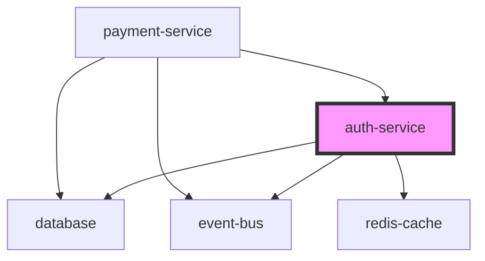

# Vibe Skills

[](https://opensource.org/licenses/MIT)
[](https://github.com/NewTurn2017/vibe-skills)

**Claude Code** · **Cursor** · **Codex CLI** · **OpenCode**

자연어를 분석, 계획, 구현, 리뷰된 코드로 바꾸는 AI 기반 개발 방법론.
하나의 명령어, 네 개의 단계, 열한 개의 에이전트.

> [Agent Skills](https://agentskills.io) 오픈 표준을 따릅니다. 동일한 SKILL.md가 모든 도구에서 작동합니다.

```
Research → Plan → Implement → Review
```

> 코드 작성은 3단계까지 없습니다. 승인된 계획 없이 구현은 시작되지 않습니다.

---

## 설치

### 원라인 설치 (권장)

설치 스크립트가 시스템에 설치된 도구를 **자동 감지**하여 적절한 위치에 설치합니다.

**macOS / Linux**

```bash
curl -fsSL https://raw.githubusercontent.com/NewTurn2017/vibe-skills/main/install.sh | bash
```

**Windows (PowerShell)**

```powershell
irm https://raw.githubusercontent.com/NewTurn2017/vibe-skills/main/install.ps1 | iex
```

### 특정 도구만 설치

```bash
# Claude Code만
curl -fsSL https://raw.githubusercontent.com/NewTurn2017/vibe-skills/main/install.sh | bash -s -- --claude

# Cursor만
curl -fsSL https://raw.githubusercontent.com/NewTurn2017/vibe-skills/main/install.sh | bash -s -- --cursor

# Codex CLI만
curl -fsSL https://raw.githubusercontent.com/NewTurn2017/vibe-skills/main/install.sh | bash -s -- --codex

# OpenCode만
curl -fsSL https://raw.githubusercontent.com/NewTurn2017/vibe-skills/main/install.sh | bash -s -- --opencode

# 모든 도구에 설치 (감지 건너뜀)
curl -fsSL https://raw.githubusercontent.com/NewTurn2017/vibe-skills/main/install.sh | bash -s -- --all
```

### 도구별 설치 경로

모든 도구가 [Agent Skills](https://agentskills.io) 표준을 따르므로 동일한 `SKILL.md` 포맷을 사용합니다.

| 도구 | 글로벌 스킬 경로 | 호환 경로 |
|------|-----------------|----------|
| **Claude Code** | `~/.claude/skills/*/SKILL.md` | — |
| **Cursor** | `~/.cursor/skills/*/SKILL.md` | `~/.claude/skills/` 자동 인식 |
| **Codex CLI** | `~/.codex/skills/*/SKILL.md` | — |
| **OpenCode** | `~/.config/opencode/skills/*/SKILL.md` | `~/.claude/skills/` 자동 인식 |

> Cursor와 OpenCode는 `~/.claude/skills/`를 호환 경로로 읽습니다.
> Claude Code에만 설치해도 이 도구들에서 사용할 수 있지만, 네이티브 경로 설치를 권장합니다.

### 수동 설치

```bash
git clone https://github.com/NewTurn2017/vibe-skills.git
cd vibe-skills
./install.sh            # 자동 감지
./install.sh --cursor   # 특정 도구 지정
```

### 설치 확인

```bash
# Claude Code / Cursor / Codex / OpenCode 공통
# 채팅에서 /vibe 입력 후 스킬이 표시되면 정상 설치

# Cursor — Settings > Rules 에서 "Agent Decides" 섹션에 vibe 스킬 확인
# Codex CLI — $vibe 로 스킬 호출
# OpenCode — /vibe 로 스킬 호출
```

---

## 핵심 철학

| 기존 방식 | Vibe Coding |
|-----------|-------------|
| AI가 즉시 코드 작성 | Research → Plan → 승인 → Implement |
| 일회성 대화로 지식 소멸 | `.vibe/` 문서로 지식 영구 보존 |
| 오류 발생 시 전체 롤백 | 체크포인트 기반 부분 롤백 |
| 개발자가 AI 출력물 수정 | 개발자가 계획 승인 후 AI 실행 |

1. **의사결정과 실행의 분리** — 개발자가 "무엇을" 결정하고, AI가 "어떻게" 실행
2. **문서 기반 개발** — 모든 분석과 계획을 `.vibe/` 디렉토리에 문서화
3. **점진적 검증** — 각 단계마다 검증 게이트로 품질 보장
4. **롤백 가능한 구현** — 체크포인트 기반으로 안전하게 되돌리기

---

## 4단계 워크플로우

### 01 · Research — 심층 리서치

코드를 변경하지 않고 코드베이스를 심층 분석합니다. 파일 맵, 데이터 플로우, 의존성 그래프, 리스크 평가가 포함된 구조화된 리서치 문서를 생성합니다.

```bash
/vibe-research "인증 시스템 분석"
```

| 옵션 | 설명 | 예시 |
|------|------|------|
| `--deep` | 성능 프로파일링, 메모리 분석, Big O 복잡도 | `/vibe-research "API 성능" --deep` |
| `--patterns` | 코드 패턴, 안티패턴, 중복 코드 감지 | `/vibe-research "리팩토링 대상" --patterns` |
| `--graph` | 의존성 그래프, 순환 참조 시각화 (mermaid) | `/vibe-research "모듈 구조" --graph` |

<details>
<summary><b>--deep 출력 예시</b></summary>

```markdown
## 6. 성능 분석

### 6.1 복잡도
| 함수 | 시간 복잡도 | 공간 복잡도 | 최적화 가능 |
|------|------------|------------|-------------|
| validatePayment | O(n²) | O(n) | Yes - HashMap 사용시 O(n) |
| processRefund | O(n log n) | O(1) | No |

### 6.2 메모리 프로파일
- 잠재적 누수: PaymentService의 eventListeners 미해제
- 대량 메모리 사용: transaction 배열 전체 로드 (평균 5MB)
```

</details>

<details>
<summary><b>--patterns 출력 예시</b></summary>

```markdown
## 5. 코드 패턴 분석

### 5.1 발견된 패턴
| 패턴 | 위치 | 빈도 | 권장사항 |
|------|------|------|----------|
| try-catch 없는 async | 12개 파일 | 45회 | 공통 에러 핸들러 추가 |
| console.log 디버깅 | 8개 파일 | 23회 | 프로덕션 제거 필요 |
| any 타입 사용 | 5개 파일 | 15회 | 구체적 타입 정의 |
```

</details>

<details>
<summary><b>--graph 출력 예시</b></summary>



</details>

산출물: `.vibe/NNN_topic_research.md`

---

### 02 · Plan — 구현 계획

리서치를 기반으로 상세 구현 계획을 수립하고 AI 리뷰를 수행합니다.

```bash
/vibe-plan  # 최신 리서치 기반
```

| 옵션 | 설명 | 예시 |
|------|------|------|
| `--research <file>` | 특정 리서치 파일 지정 | `/vibe-plan --research 002_auth.md` |
| `--feedback` | 기존 plan의 인라인 메모 반영 | `/vibe-plan --feedback` |
| `--review` | AI 기반 계획 완성도 평가 | `/vibe-plan --review` |
| `--risk-analysis` | 상세 리스크 분석 및 시뮬레이션 | `/vibe-plan --risk-analysis` |

<details>
<summary><b>--review 출력 예시</b></summary>

```yaml
AI Review Report:
  완성도 점수: 85/100

  누락 요소:
    - 보안: Rate limiting 계획 없음
    - 성능: 캐싱 전략 미정의
    - 테스트: E2E 테스트 계획 부족

  강점:
    - 명확한 구현 순서
    - 상세한 롤백 전략

  개선 제안:
    1. API 엔드포인트별 rate limit 정의
    2. Redis 캐싱 레이어 추가
    3. Critical path E2E 시나리오 추가
```

</details>

<details>
<summary><b>--risk-analysis 출력 예시</b></summary>

```markdown
## 9. 리스크 분석

### 9.1 리스크 매트릭스
| 리스크 | 확률 | 영향도 | 레벨 | 완화 전략 |
|--------|------|--------|------|----------|
| 성능 저하 | 40% | High | Critical | 점진적 롤아웃, 카나리 배포 |
| 데이터 손실 | 5% | Critical | High | 백업, 트랜잭션, 롤백 스크립트 |

### 9.2 시나리오 시뮬레이션
- 최선: 2일 내 완료, 성능 30% 개선
- 현실적: 3일 소요, 성능 15% 개선
- 최악: 5일 지연, 롤백 필요
```

</details>

산출물: `.vibe/NNN_topic_plan.md`

---

### 03 · Implement — 기계적 구현

승인된 계획을 기반으로 코드를 구현하고 실시간 검증을 수행합니다.

```bash
/vibe-implement  # 최신 승인된 plan 실행
```

| 옵션 | 설명 | 예시 |
|------|------|------|
| `--plan <file>` | 특정 plan 파일 지정 | `/vibe-implement --plan 003_auth_plan.md` |
| `--parallel` | 병렬 실행 모드 (의존성 분석) | `/vibe-implement --parallel` |
| `--watch` | 파일 변경 감지 및 실시간 검증 | `/vibe-implement --watch` |
| `--rollback-on-fail` | 실패 시 자동 롤백 | `/vibe-implement --rollback-on-fail` |
| `--dry-run` | 실제 변경 없이 시뮬레이션 | `/vibe-implement --dry-run` |

<details>
<summary><b>병렬 실행 전략</b></summary>

```
Group 1 (병렬 가능):
  → types/*.ts (4 workers)
  → constants/*.ts (2 workers)

Group 2 (Group 1 완료 후):
  → utils/*.ts (3 workers)
  → lib/*.ts (3 workers)

Group 3 (Group 2 완료 후):
  → services/*.ts (2 workers)
  → api/*.ts (2 workers)

예상 시간:
- 순차 실행: 45분
- 병렬 실행: 15분 (67% 단축)
```

</details>

<details>
<summary><b>롤백 트리거</b></summary>

- 빌드 실패 → 즉시 롤백
- 테스트 실패율 > 10% → 자동 롤백
- 타입 에러 > 5개 → 롤백 제안
- 성능 저하 > 20% → 롤백 확인

</details>

---

### 04 · Review — 자동 코드 리뷰

보안(OWASP), 성능, 품질, 테스트 커버리지를 아우르는 다차원 코드 리뷰를 수행합니다.

```bash
/vibe-review  # 현재 브랜치 리뷰
```

| 옵션 | 설명 | 예시 |
|------|------|------|
| `--branch <name>` | 특정 브랜치 리뷰 | `/vibe-review --branch feature/auth` |
| `--focus <area>` | 특정 영역 집중 | `/vibe-review --focus security` |
| `--pr-ready` | PR 생성용 리포트 | `/vibe-review --pr-ready` |
| `--auto-fix` | 자동 수정 가능한 이슈 처리 | `/vibe-review --auto-fix` |
| `--strict` | 엄격한 기준 적용 | `/vibe-review --strict` |

**Focus 영역:**

| Focus | 분석 내용 |
|-------|-----------|
| `security` | OWASP Top 10, 인증/인가, 데이터 보호, 의존성 취약점 |
| `performance` | 시간/공간 복잡도, 메모리 누수, 캐싱, 번들 최적화 |
| `accessibility` | WCAG 2.1, 키보드 네비게이션, 스크린 리더 |
| `testing` | 커버리지, 테스트 품질, 엣지 케이스 |
| `architecture` | SOLID 원칙, 디자인 패턴, 모듈화, 의존성 관리 |

산출물: `.vibe/reviews/YYYYMMDD-review.md`

---

## Smart Mode

자연어로 요청하면 AI가 의도를 파악하여 자동으로 필요한 분석을 수행합니다. 옵션을 명시할 필요가 없습니다.

```bash
/vibe-research "로그인이 왜 이렇게 느려?"     # → --deep 자동 선택
/vibe-research "이 코드 좀 정리해야 할 것 같아"  # → --patterns 자동 선택
/vibe-research "결제 모듈 전체적으로 분석해줘"   # → 모든 옵션 자동 선택
```

**신뢰도 시스템:**
- **90% 이상** — 자동 실행
- **70–90%** — 간단 확인 후 실행
- **70% 미만** — 사용자에게 선택지 제공

**자연어 인식 패턴:**

| 키워드 | 자동 활성화 |
|--------|-----------|
| 느려요, 성능, 최적화, 메모리 누수 | `--deep` |
| 정리, 중복, 리팩토링, 안티패턴 | `--patterns` |
| 의존성, 구조, 순환 참조, 영향 범위 | `--graph` |
| 전체, 종합 | 모든 옵션 |

---

## Team Mode

복잡한 작업을 여러 전문 에이전트가 동시에 처리합니다. AI가 자동으로 복잡도를 판단하여 Single/Team 모드를 선택합니다.

> Team Mode는 [oh-my-claudecode](https://github.com/nicobailey-omc/oh-my-claudecode) 플러그인이 필요합니다. 미설치 시 기존 Single Mode로 동작합니다.

```bash
/vibe "team 인증 시스템 전체 분석"      # 명시적 team 모드
/vibe "인증 시스템 전체 분석"           # 자동 감지 → team 활성화
/vibe "team 5:executor 결제 모듈 구현"  # 워커 수/타입 지정
/vibe "solo 로그인 분석"               # 강제 single 모드
```

### 자동 감지 기준

| Phase | Team Mode 활성화 조건 | Single Mode |
|-------|---------------------|-------------|
| Research | 분석 옵션 2개 이상 또는 `전체` 키워드 | 옵션 0–1개 |
| Plan | 다중 모듈 범위 또는 `--review` + `--risk-analysis` | 단일 모듈 |
| Implement | 변경 파일 6개 이상 또는 `team` 키워드 | 5개 이하 |
| Review | 다중 focus 또는 `--strict` | 단일 focus |

### 단계별 전문 에이전트

```
TeamCreate("vibe-NNN")
  ├─ Research : explore + analyst + architect    (병렬 분석)
  ├─ Plan     : planner → architect + critic     (순차 + 병렬 리뷰)
  ├─ Implement: executor × N + test-engineer     (그룹별 병렬 구현)
  └─ Review   : code-reviewer + security + verifier (병렬 리뷰)
TeamDelete()
```

| 단계 | 에이전트 | 모델 | 역할 |
|------|---------|------|------|
| Research | `explore` | haiku | 코드베이스 구조 탐색 |
| | `analyst` | opus | 성능/패턴 분석 |
| | `architect` | opus | 의존성/리스크 분석 |
| Plan | `planner` | opus | 구현 전략 수립 |
| | `architect` | opus | 아키텍처 리뷰 |
| | `critic` | opus | 계획 도전/리스크 |
| Implement | `executor` | sonnet | 코드 구현 |
| | `designer` | sonnet | UI 컴포넌트 |
| | `test-engineer` | sonnet | 테스트 작성 |
| Review | `code-reviewer` | opus | 품질/SOLID |
| | `security-reviewer` | sonnet | OWASP 스캔 |
| | `verifier` | sonnet | 테스트/빌드 검증 |

---

## 사용 예제

### 전체 워크플로우

```bash
# 1. 리서치
/vibe-research "결제 시스템 통합" --deep --patterns --graph
# → .vibe/001_payment_integration_research.md

# 2. 계획
/vibe-plan --review --risk-analysis
# → .vibe/001_payment_integration_plan.md (AI 리뷰 88/100)

# 3. 피드백 반영
/vibe-plan --feedback

# 4. 구현
/vibe-implement --parallel --watch --rollback-on-fail

# 5. 리뷰
/vibe-review --focus security --pr-ready --auto-fix
# → .vibe/reviews/20240315-review.md + PR 템플릿
```

### 시나리오별

<details>
<summary><b>레거시 코드 리팩토링</b></summary>

```bash
/vibe-research "레거시 인증 모듈" --patterns --graph
/vibe-plan --risk-analysis
/vibe-implement --rollback-on-fail --dry-run   # 시뮬레이션 먼저
/vibe-implement --rollback-on-fail             # 실제 구현
/vibe-review --strict
```

</details>

<details>
<summary><b>성능 최적화</b></summary>

```bash
/vibe-research "API 응답 속도" --deep
/vibe-plan --review
/vibe-implement --parallel --watch
/vibe-review --focus performance
```

</details>

<details>
<summary><b>보안 강화</b></summary>

```bash
/vibe-research "보안 취약점" --deep --patterns
/vibe-plan --risk-analysis
/vibe-implement --rollback-on-fail
/vibe-review --focus security --strict
```

</details>

---

## 고급 기능

### 커스텀 설정

```yaml
# .vibe/config.yaml
research:
  default_mode: ["deep", "patterns"]
  auto_index: true
  max_file_size: 10000

plan:
  require_approval: true
  min_review_score: 80
  risk_threshold: "medium"

implement:
  default_parallel: true
  max_workers: 4
  auto_rollback: true
  checkpoint_interval: 5

review:
  default_focus: ["security", "performance"]
  strict_mode: false
  auto_fix: true
```

### Smart Mode 설정

```yaml
# .vibe/smart-mode.yaml
smart_mode:
  enabled: true
  language: "ko"  # ko, en, auto
  auto_execute_threshold: 0.9
  confirm_threshold: 0.7

  custom_keywords:
    deep:
      - "우리 서비스 느림"
      - "고객 불만"
    patterns:
      - "코드 리뷰 전"
      - "PR 올리기 전"

  project_type: "frontend"
  main_language: "typescript"
```

### CI/CD 통합

<details>
<summary><b>GitHub Actions</b></summary>

```yaml
# .github/workflows/vibe-review.yml
name: Vibe Review

on:
  pull_request:
    types: [opened, synchronize]

jobs:
  vibe-review:
    runs-on: ubuntu-latest
    steps:
      - uses: actions/checkout@v3
      - name: Setup Claude Code
        uses: anthropic/claude-code-action@v1
      - name: Run Vibe Review
        run: |
          claude-code vibe-review \
            --branch ${{ github.head_ref }} \
            --focus security,performance \
            --pr-ready --strict
      - name: Upload Review Report
        uses: actions/upload-artifact@v3
        with:
          name: vibe-review-report
          path: .vibe/reviews/
```

</details>

<details>
<summary><b>Pre-commit Hook</b></summary>

```bash
#!/bin/bash
# .git/hooks/pre-commit
echo "Running Vibe Review..."
claude-code vibe-review --focus security --auto-fix
if [ $? -ne 0 ]; then
  echo "Security issues found. Fix before committing."
  exit 1
fi
```

</details>

---

## 사전 요구사항

### 기본 (Single Mode)

별도 의존성 없이 바로 사용 가능합니다. 아래 도구가 있으면 더 정확한 분석이 가능합니다 (선택사항):

| 도구 | 용도 | 설치 |
|------|------|------|
| [ripgrep](https://github.com/BurntSushi/ripgrep) (`rg`) | 고속 텍스트 검색 | `brew install ripgrep` |
| [fd](https://github.com/sharkdp/fd) | 파일 탐색 | `brew install fd` |
| [ast-grep](https://github.com/ast-grep/ast-grep) (`sg`) | 구조적 코드 패턴 검색 | `brew install ast-grep` |
| [tokei](https://github.com/XAMPPRocky/tokei) | 코드 통계 | `brew install tokei` |

### Team Mode

[oh-my-claudecode](https://github.com/nicobailey-omc/oh-my-claudecode) 플러그인 필요:

```bash
/install-plugin oh-my-claudecode
```

---

## FAQ

<details>
<summary><b>Cursor에서 어떻게 사용하나요?</b></summary>

설치 스크립트가 `~/.cursor/skills/`에 동일한 SKILL.md를 설치합니다. Cursor 2.4+는 [Agent Skills](https://agentskills.io) 표준을 지원하여, Settings > Rules의 "Agent Decides" 섹션에서 vibe 스킬이 표시됩니다. 채팅에서 `/vibe`로 수동 호출하거나, AI가 컨텍스트를 판단하여 자동 적용합니다.

</details>

<details>
<summary><b>Codex CLI에서 어떻게 사용하나요?</b></summary>

설치 스크립트가 `~/.codex/skills/`에 SKILL.md를 설치합니다. 프롬프트에서 `$vibe`로 스킬을 호출할 수 있습니다. Codex는 description 필드를 기반으로 관련 스킬을 자동 활성화하기도 합니다.

</details>

<details>
<summary><b>OpenCode에서 어떻게 사용하나요?</b></summary>

설치 스크립트가 `~/.config/opencode/skills/`에 SKILL.md를 설치합니다. 채팅에서 `/vibe`로 호출합니다. OpenCode는 `~/.claude/skills/`도 호환 경로로 인식하므로, Claude Code에만 설치해도 사용할 수 있습니다.

</details>

<details>
<summary><b>여러 도구를 동시에 사용할 수 있나요?</b></summary>

네. 플래그 없이 설치하면 시스템에 설치된 모든 도구를 자동 감지하여 각각에 맞는 포맷으로 설치합니다. `--all` 플래그로 감지를 건너뛰고 모든 도구에 강제 설치할 수도 있습니다.

</details>

<details>
<summary><b>Team Mode가 활성화되지 않아요.</b></summary>

Team Mode는 oh-my-claudecode 플러그인이 필요합니다. 미설치 시 자동으로 Single Mode로 fallback합니다. 현재 Team Mode는 Claude Code 환경에서만 지원됩니다.

</details>

<details>
<summary><b>프로젝트별로 다른 설정을 사용할 수 있나요?</b></summary>

네. 프로젝트 루트에 `.vibe/config.yaml`을 생성하면 프로젝트별 설정이 적용됩니다. Smart Mode도 `.vibe/smart-mode.yaml`로 프로젝트별 커스터마이징이 가능합니다.

</details>

---

## 기여하기

```bash
git clone https://github.com/NewTurn2017/vibe-skills.git
cd vibe-skills
# skills/ 디렉토리의 SKILL.md 파일을 수정 후 PR
```

스킬 파일 구조:

```
skills/
├── vibe/               # 통합 명령어 (자동 단계 감지)
├── vibe-research/      # 01 심층 리서치
├── vibe-plan/          # 02 구현 계획
├── vibe-implement/     # 03 기계적 구현
└── vibe-review/        # 04 자동 코드 리뷰
```

---

## 라이선스

[MIT](LICENSE)

Made by [Genie](https://github.com/NewTurn2017)
