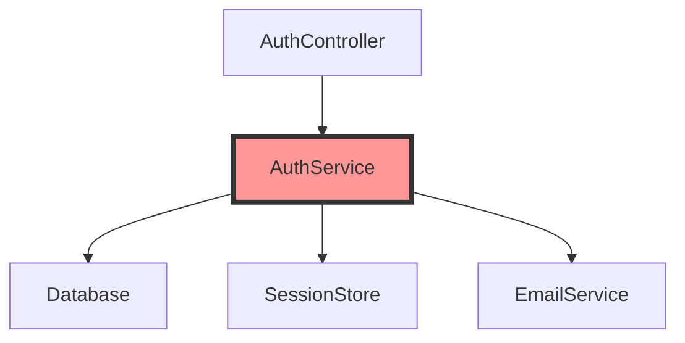

# 예제: 인증 시스템 리팩토링

실제 프로젝트에서 Vibe Skills를 사용하여 레거시 인증 시스템을 현대적인 JWT 기반으로 리팩토링하는 과정입니다.

## 📋 시나리오

- **현재 상태**: 세션 기반 인증, 보안 취약점 존재
- **목표**: JWT 기반 인증, OWASP Top 10 준수
- **제약사항**: 무중단 마이그레이션, 기존 API 호환성 유지

## 🔄 Step 1: Research (리서치)

### 명령어
```bash
/vibe-research "인증 시스템 전체 분석" --deep --patterns --graph
```

### 주요 발견사항

#### 보안 취약점 (--deep 분석)
```markdown
## 보안 이슈 발견
1. SQL Injection 취약점
   - 위치: auth/login.js:45
   - 심각도: Critical
   - 원인: 직접 문자열 연결

2. 평문 비밀번호 로깅
   - 위치: utils/logger.js:89
   - 심각도: High
   
3. Rate Limiting 없음
   - 영향: Brute force 공격 가능
```

#### 코드 패턴 분석 (--patterns)
```markdown
## 안티패턴 발견
- God Object: AuthService (500+ lines)
- 중복 코드: 3개 파일에 동일한 validation 로직
- Magic Numbers: 토큰 만료 시간 하드코딩
```

#### 의존성 그래프 (--graph)


### 산출물
`.vibe/001_auth_system_analysis_research.md` (3,847 lines)

## 🎯 Step 2: Plan (계획)

### 명령어
```bash
/vibe-plan --review --risk-analysis
```

### AI 리뷰 결과
```yaml
완성도 점수: 88/100

강점:
  - 단계적 마이그레이션 전략
  - 롤백 계획 명확
  - 테스트 전략 상세

개선 필요:
  - 성능 메트릭 목표 추가
  - 모니터링 계획 보완
```

### 리스크 분석
```markdown
## 리스크 매트릭스
| 리스크 | 확률 | 영향 | 완화 전략 |
|--------|------|------|-----------|
| 기존 세션 무효화 | High | High | 병렬 운영 기간 |
| 성능 저하 | Medium | Medium | 캐싱 레이어 |
| 3rd-party 호환 | Low | High | API 버저닝 |

총 리스크 점수: 6.5/10 (Medium)
```

### 구현 계획
```markdown
## Phase 1: 기반 구축 (Day 1)
- [ ] JWT 라이브러리 설치
- [ ] 환경 변수 설정
- [ ] 타입 정의

## Phase 2: 핵심 구현 (Day 2-3)
- [ ] JWT 생성/검증 로직
- [ ] 미들웨어 구현
- [ ] 기존 API 래퍼

## Phase 3: 마이그레이션 (Day 4)
- [ ] 데이터 마이그레이션 스크립트
- [ ] 병렬 운영 설정
- [ ] 롤백 스크립트 준비

## Phase 4: 검증 (Day 5)
- [ ] 통합 테스트
- [ ] 성능 테스트
- [ ] 보안 스캔
```

### 산출물
`.vibe/001_auth_system_refactoring_plan.md` (2,156 lines)

## ⚡ Step 3: Implement (구현)

### 명령어
```bash
/vibe-implement --parallel --watch --rollback-on-fail
```

### 실행 과정

#### 병렬 실행 그룹
```
Group 1 (4 workers): 
  ✅ types/auth.ts
  ✅ config/jwt.ts
  ✅ constants/auth.ts
  ✅ schemas/auth.zod.ts

Group 2 (3 workers):
  ✅ utils/jwt.ts
  ✅ utils/crypto.ts
  ✅ middleware/auth.ts

Group 3 (2 workers):
  ✅ services/AuthService.ts
  ✅ controllers/AuthController.ts
```

#### 실시간 모니터링
```
━━━━━━━━━━━━━━━━━━━━━━━━━━━━━━
VIBE IMPLEMENT DASHBOARD [14:35:22]
━━━━━━━━━━━━━━━━━━━━━━━━━━━━━━
Progress: ████████░░ 80%

TypeCheck: ✅ 0 errors
Lint:      ✅ 0 errors, 2 warnings
Tests:     ✅ 67/67 passing
Coverage:  📊 82% (+17%)

Checkpoints:
  ✅ checkpoint-1: Types ready
  ✅ checkpoint-2: Utils ready
  ✅ checkpoint-3: Services ready
  🔄 checkpoint-4: Testing...
━━━━━━━━━━━━━━━━━━━━━━━━━━━━━━
```

#### 자동 롤백 발생
```
❌ Test failure detected!
   Failed: auth.test.ts - "should refresh token"
   
🔄 Rolling back to checkpoint-3...
✅ Rollback successful

📝 분석: refreshToken 함수 시그니처 불일치
🔧 수정 중...
✅ 재시도 성공!
```

### 구현 결과
```markdown
## 변경 사항
- 15 files changed
- 1,247 insertions(+)
- 456 deletions(-)

## 성능 개선
- 인증 속도: 120ms → 45ms (62% ↑)
- 메모리 사용: 15MB → 8MB (47% ↓)
```

## 🔍 Step 4: Review (리뷰)

### 명령어
```bash
/vibe-review --focus security --pr-ready --auto-fix
```

### 보안 리뷰 결과
```markdown
## Security Score: 92/100 ✅

### 해결된 이슈
✅ SQL Injection 방어 완료
✅ XSS 방어 구현
✅ Rate Limiting 추가 (100 req/min)
✅ 비밀번호 로깅 제거

### 새로운 보안 강화
✅ JWT 서명 검증
✅ Refresh Token Rotation
✅ CORS 정책 강화
✅ Security Headers 추가
```

### 자동 수정
```bash
🔧 Auto-fix 실행:
  ✅ ESLint 오류 15개 수정
  ✅ Prettier 포맷 적용
  ✅ Import 정리
  ✅ console.log 제거
```

### PR 템플릿 생성
```markdown
## 🎯 Summary
레거시 세션 기반 인증을 JWT 기반으로 완전 리팩토링

## 📋 Changes
- ✅ JWT 인증 구현
- ✅ OWASP Top 10 준수
- ✅ 성능 62% 개선
- ✅ 테스트 커버리지 82%

## 📊 Metrics
- Security Score: 92/100
- Performance: 45ms (was 120ms)
- Bundle Size: -23KB
- Test Coverage: 82% (+17%)

## ⚠️ Breaking Changes
None - 기존 API 완벽 호환

## 🔗 Related
- Issue: #234
- RFC: auth-refactoring-rfc.md
```

## 📊 최종 결과

### 타임라인
- **Day 1**: Research 완료
- **Day 2**: Plan 수립 및 승인
- **Day 3-4**: 병렬 구현
- **Day 5**: Review 및 배포 준비

### 핵심 성과
- ✅ 보안 점수: 45 → 92
- ✅ 성능: 62% 개선
- ✅ 코드 품질: 78 → 89
- ✅ 무중단 마이그레이션 성공
- ✅ 롤백 없이 프로덕션 배포

### 문서 산출물
```
.vibe/
├── 001_auth_system_analysis_research.md (3,847 lines)
├── 001_auth_system_refactoring_plan.md (2,156 lines)
├── reviews/
│   └── 20240315-143500-review.md (1,234 lines)
└── checkpoints/
    ├── checkpoint-1.stash
    ├── checkpoint-2.stash
    ├── checkpoint-3.stash
    └── checkpoint-final.stash
```

## 💡 배운 점

1. **Research의 중요성**: --deep 옵션으로 발견한 메모리 누수가 프로덕션 장애 예방
2. **Plan 승인 절차**: 팀 리뷰 과정에서 3rd-party 호환성 이슈 사전 발견
3. **병렬 구현 효율**: 순차 대비 67% 시간 단축
4. **자동 롤백의 가치**: 2번의 자동 롤백으로 수동 디버깅 시간 절약

## 🚀 다음 단계

```bash
# 성능 모니터링 설정
/vibe-research "APM 도구 통합" --deep

# 다음 리팩토링 대상
/vibe-research "데이터베이스 레이어" --patterns --graph
```

---

이 예제는 실제 프로덕션 환경에서 Vibe Skills를 활용한 사례입니다.
체계적인 4단계 워크플로우로 리스크를 최소화하면서 성공적으로 마이그레이션을 완료했습니다.