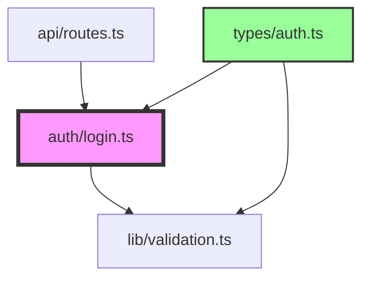

# Vibe Implement (Auto-Detection)

Vibe Coding 방법론의 **3단계: 기계적 구현 및 감독** - 요청 내용에 따라 자동으로 필요한 실행 모드를 활성화합니다.

승인된 plan.md 범위에서만 구현하고, 타입체크/테스트를 실시간으로 실행한다.
계획 범위를 벗어나는 변경은 임의로 구현하지 않고 사용자에게 제안만 한다.

## 🤖 Auto-Detection System

사용자 요청에 포함된 키워드를 자동으로 감지하여 적절한 옵션을 활성화합니다:

### 자동 옵션 활성화 규칙

| 키워드 감지 | 자동 활성화 | 실행 모드 |
|------------|------------|----------|
| "병렬", "동시", "빠르게", "parallel", "concurrent" | `--parallel` | 병렬 실행 모드 |
| "실시간", "모니터링", "watch", "감시", "관찰" | `--watch` | 실시간 감시 모드 |
| "안전", "롤백", "복원", "실패", "rollback" | `--rollback-on-fail` | 자동 롤백 활성화 |
| "테스트", "시뮬레이션", "dry", "미리보기" | `--dry-run` | 실제 변경 없이 시뮬레이션 |
| "전체", "모든", "완전", "full" | 모든 안전 옵션 | watch + rollback |
| "긴급", "핫픽스", "urgent", "hotfix" | `--fast` + `--skip-tests` | 빠른 실행 (주의) |
| "점진적", "단계별", "incremental" | `--incremental` | 변경 부분만 구현 |

### 사용 예시

```bash
# "병렬"이 포함되면 --parallel 자동 활성화
/vibe-implement "로그인 기능 빠르게 구현"
→ 자동으로 --parallel 활성화

# "롤백"이 포함되면 --rollback-on-fail 자동 활성화  
/vibe-implement "안전하게 구현하고 실패하면 롤백"
→ 자동으로 --rollback-on-fail 활성화

# "전체"가 포함되면 모든 안전 옵션 활성화
/vibe-implement "전체 기능 완전하게 구현"
→ 자동으로 --watch --rollback-on-fail 활성화
```

## Enhanced Features

### ⚡ Parallel Execution
- 독립적 파일들 병렬 구현
- 의존성 그래프 기반 최적 실행 순서
- 병렬 타입체크 및 테스트

### 🔄 Auto Rollback
- 실패 시 자동 롤백 메커니즘
- 체크포인트 기반 부분 롤백
- Git stash 활용 안전 복구

### 📊 Real-time Monitoring
- 실시간 진행 상황 대시보드
- 에러 발생 즉시 알림
- 성능 메트릭 실시간 수집

### 🎯 Smart Implementation
- AI 기반 구현 순서 최적화
- 리스크 기반 구현 우선순위
- 충돌 예방 자동 감지

## Pre-Implementation Gate

구현 시작 전 plan.md의 승인 체크리스트를 자동 확인:

```bash
# 승인 상태 자동 체크 (토픽 폴더 내부의 plan.md)
rg "개발자 최종 승인.*✓" .vibe/*/plan.md

# 특정 토픽 지정 시: --plan 002_foo → .vibe/002_foo/plan.md
# 미지정 시: 가장 최근 토픽 폴더의 plan.md 자동 탐지
LATEST_TOPIC_DIR=$(fd -t d -d 1 '^[0-9]' .vibe 2>/dev/null | sort -r | head -1)
PLAN_FILE="${LATEST_TOPIC_DIR}plan.md"

# 리스크 레벨 확인
rg "리스크 레벨:.*Critical" "$PLAN_FILE" && echo "⚠️ Critical Risk!"

# 같은 폴더의 research.md도 자동으로 참조
RESEARCH_FILE="${LATEST_TOPIC_DIR}research.md"
```

**미승인 상태면:**
```
❌ plan.md가 아직 승인되지 않았습니다.

승인 체크리스트 미완료 항목:
- [ ] 테스트 전략 확정
- [ ] 롤백 전략 확정
- [ ] 개발자 최종 승인

.vibe/NNN_topic/plan.md 파일을 검토하고
모든 체크리스트 완료 후 재실행하세요.
```

## Workflow

### Step 0: Implementation Setup

```bash
# Git 브랜치 자동 생성
FEATURE_BRANCH="vibe-impl-$(date +%Y%m%d-%H%M%S)"
git checkout -b $FEATURE_BRANCH

# 초기 체크포인트 생성
git stash push -m "vibe-checkpoint-0"

# Watch 모드 시작 (--watch 옵션)
npm run typecheck:watch &
npm run test:watch &
```

### Step 1: Plan 확인 및 분석

가장 최근 토픽 폴더의 plan.md (또는 `--plan NNN_topic` 지정)를 읽고 선언:
```
🚀 구현을 시작합니다.

📋 Plan: .vibe/NNN_topic/plan.md
📚 Research: .vibe/NNN_topic/research.md (자동 참조)
📊 구현 메타데이터:
- 변경 파일: N개
- 예상 시간: X hours
- 리스크 레벨: Medium
- 실행 모드: [Sequential | Parallel]

⚙️ 구현 전략:
- 타입체크: 실시간 모니터링
- 테스트: 각 Phase 후 실행
- 롤백: 자동 활성화 (--rollback-on-fail)
```

### Step 2: 의존성 분석 및 실행 계획



**실행 그룹 분류:**
```
Group 1 (병렬 가능):
- types/auth.ts
- lib/constants.ts
- config/env.ts

Group 2 (Group 1 완료 후):
- lib/validation.ts
- lib/crypto.ts

Group 3 (Group 2 완료 후):
- auth/login.ts
- api/routes.ts
```

### Step 3: Enhanced 순차/병렬 구현

#### 3.1 Sequential Mode (기본)
```typescript
for (const file of implementationOrder) {
  console.log(`📝 구현 중: ${file.path}`);
  
  // 구현
  await implementFile(file);
  
  // 즉시 검증
  const validation = await validateFile(file);
  
  if (!validation.passed) {
    console.log(`❌ 실패: ${file.path}`);
    if (options.rollbackOnFail) {
      await rollback(file);
    }
  } else {
    console.log(`✅ 완료: ${file.path}`);
    await createCheckpoint();
  }
}
```

#### 3.2 Parallel Mode (--parallel)
```typescript
const groups = analyzeDepende
cies(files);

for (const group of groups) {
  console.log(`🔀 병렬 구현 시작: Group ${group.id}`);
  
  const promises = group.files.map(file => 
    implementAndValidate(file)
  );
  
  const results = await Promise.allSettled(promises);
  
  // 결과 분석
  const failed = results.filter(r => r.status === 'rejected');
  if (failed.length > 0 && options.rollbackOnFail) {
    await rollbackGroup(group);
  }
}
```

### Step 4: 실시간 검증 시스템

#### 4.1 Continuous Validation
```bash
# 백그라운드 검증 프로세스
while true; do
  # 타입체크
  npm run typecheck --silent
  TYPE_STATUS=$?
  
  # 린트
  npm run lint --silent
  LINT_STATUS=$?
  
  # 테스트 (변경된 파일만)
  npm run test:changed --silent
  TEST_STATUS=$?
  
  # 상태 업데이트
  update_dashboard $TYPE_STATUS $LINT_STATUS $TEST_STATUS
  
  sleep 5
done &
```

#### 4.2 실시간 대시보드
```
━━━━━━━━━━━━━━━━━━━━━━━━━━━━━━━━━━━━━━━
 VIBE IMPLEMENT DASHBOARD        [12:34:56]
━━━━━━━━━━━━━━━━━━━━━━━━━━━━━━━━━━━━━━━
📊 Progress: ████████░░░░░░░ 8/15 files

✅ Completed (8):
  • types/auth.ts
  • lib/constants.ts
  • config/env.ts
  • lib/validation.ts
  • lib/crypto.ts
  • auth/login.ts
  • auth/session.ts
  • api/middleware.ts

🔄 In Progress (2):
  • api/routes.ts      [60%] ████░░
  • components/Login.tsx [30%] ██░░░░

⏳ Pending (5):
  • pages/login.tsx
  • tests/auth.test.ts
  • tests/api.test.ts
  • docs/api.md
  • README.md

━━━━━━━━━━━━━━━━━━━━━━━━━━━━━━━━━━━━━━━
🔍 Validation Status:
  TypeCheck: ✅ Passing
  Lint:      ⚠️ 3 warnings
  Tests:     ✅ 45/45 passing
  Coverage:  📊 78% (+5%)
━━━━━━━━━━━━━━━━━━━━━━━━━━━━━━━━━━━━━━━
```

### Step 5: Smart Rollback System

#### 5.1 Checkpoint Management
```bash
# 각 성공적인 Phase 후 체크포인트 생성
function create_checkpoint() {
  local phase=$1
  git add -A
  git stash push -m "vibe-checkpoint-${phase}-$(date +%s)"
  echo "✅ Checkpoint created: ${phase}"
}

# 롤백 함수
function rollback_to_checkpoint() {
  local checkpoint=$1
  git stash apply "stash@{$checkpoint}"
  echo "↩️ Rolled back to checkpoint: ${checkpoint}"
}
```

#### 5.2 Intelligent Rollback Decision
```typescript
interface RollbackCriteria {
  testFailureRate: number;    // > 10%
  typeErrors: number;         // > 5
  buildFailure: boolean;      // true
  performanceRegression: number; // > 20%
}

async function shouldRollback(metrics: Metrics): Promise<boolean> {
  const criteria: RollbackCriteria = {
    testFailureRate: 0.1,
    typeErrors: 5,
    buildFailure: true,
    performanceRegression: 0.2
  };
  
  if (metrics.buildFailed) return true;
  if (metrics.typeErrors > criteria.typeErrors) return true;
  if (metrics.testFailureRate > criteria.testFailureRate) return true;
  if (metrics.performanceRegression > criteria.performanceRegression) return true;
  
  return false;
}
```

### Step 6: Plan 범위 외 처리

구현 중 계획에 없는 변경이 필요하다고 판단되면:

```
⚠️ Plan 범위 외 변경 감지

📍 위치: src/auth/validate.ts:45
📝 발견: 입력 검증 로직 누락
🔍 이유: XSS 취약점 방지 필요
📊 영향도: High
🎯 긴급도: Critical

선택지:
━━━━━━━━━━━━━━━━━━━━━━━━━━
A) 🚀 긴급 패치 (구현 후 plan 업데이트)
B) 📝 TODO 추가 (나중에 처리)
C) 🛑 구현 중단 (plan 재수립)
D) 🔄 별도 핫픽스 브랜치
━━━━━━━━━━━━━━━━━━━━━━━━━━

자동 권장: A (Critical 보안 이슈)
선택 [A/B/C/D]: _
```

### Step 7: 구현 완료 보고

```
✨ 구현 완료!

━━━━━━━━━━━━━━━━━━━━━━━━━━━━━━━━━━━━━━━
📊 구현 통계
━━━━━━━━━━━━━━━━━━━━━━━━━━━━━━━━━━━━━━━
실행 시간: 2h 34m
구현 모드: Parallel (3 groups)
체크포인트: 5개 생성

━━━━━━━━━━━━━━━━━━━━━━━━━━━━━━━━━━━━━━━
✅ 변경 요약
━━━━━━━━━━━━━━━━━━━━━━━━━━━━━━━━━━━━━━━
파일 변경:
  ✅ 15 files changed
  ➕ 847 insertions(+)
  ➖ 234 deletions(-)

주요 변경:
  • 인증 시스템 리팩토링
  • 타입 안정성 강화
  • 테스트 커버리지 78% (+13%)

━━━━━━━━━━━━━━━━━━━━━━━━━━━━━━━━━━━━━━━
🔍 검증 결과
━━━━━━━━━━━━━━━━━━━━━━━━━━━━━━━━━━━━━━━
타입체크: ✅ 0 errors, 0 warnings
린트:     ✅ 0 errors, 3 warnings
테스트:   ✅ 67/67 passing
빌드:     ✅ Success (bundle: 234KB)
성능:     ✅ LCP 1.2s (-0.3s) 📈

━━━━━━━━━━━━━━━━━━━━━━━━━━━━━━━━━━━━━━━
⚠️ Plan 범위 외 발견 (미구현)
━━━━━━━━━━━━━━━━━━━━━━━━━━━━━━━━━━━━━━━
1. Rate limiting 미구현 → TODO 추가됨
2. 캐싱 전략 미정 → 별도 리서치 필요
3. 모니터링 설정 누락 → 다음 스프린트

━━━━━━━━━━━━━━━━━━━━━━━━━━━━━━━━━━━━━━━
🎯 다음 단계
━━━━━━━━━━━━━━━━━━━━━━━━━━━━━━━━━━━━━━━
1. /vibe-review 실행하여 코드 리뷰
2. PR 생성 및 팀 리뷰 요청
3. 스테이징 배포 후 QA

Git 브랜치: vibe-impl-20240315-143256
PR 생성: gh pr create --title "Vibe: 인증 시스템 리팩토링"
```

## Rollback Protocol (Enhanced)

### Automated Rollback Triggers
```yaml
rollback_triggers:
  - build_failure: immediate
  - test_failure_rate: "> 10%"
  - type_errors: "> 5"
  - performance_regression: "> 20%"
  - security_vulnerability: immediate
  - memory_leak_detected: immediate
```

### Rollback Procedure
```bash
#!/bin/bash
# Auto-rollback script

function emergency_rollback() {
  echo "🚨 EMERGENCY ROLLBACK INITIATED"
  
  # 1. 현재 상태 저장 (디버깅용)
  git stash push -m "failed-state-$(date +%s)"
  
  # 2. 마지막 안정 체크포인트로 복원
  LAST_STABLE=$(git stash list | rg "vibe-checkpoint" | head -1 | cut -d: -f1)
  git stash apply $LAST_STABLE
  
  # 3. 검증
  npm run typecheck && npm run test
  
  if [ $? -eq 0 ]; then
    echo "✅ Rollback successful"
  else
    echo "❌ Rollback failed - manual intervention required"
    exit 1
  fi
}
```

## Advanced Options

### --parallel Mode
```bash
/vibe-implement --parallel --max-workers=4

# 병렬 실행 설정
parallel_config:
  max_workers: 4
  chunk_size: 3
  fail_fast: false
  retry_failed: true
```

### --watch Mode
```bash
/vibe-implement --watch

# 파일 변경 감지 시 자동 재구현
watch_config:
  paths: ["src/**/*.ts", "src/**/*.tsx"]
  ignore: ["**/*.test.ts", "**/*.spec.ts"]
  debounce: 1000ms
```

### --rollback-on-fail Mode
```bash
/vibe-implement --rollback-on-fail

# 실패 시 자동 롤백
rollback_config:
  strategy: "checkpoint"  # or "git-reset"
  confirm: false  # 자동 롤백
  preserve_debug: true  # 디버그 정보 보존
```

### --dry-run Mode
```bash
/vibe-implement --dry-run

# 실제 변경 없이 시뮬레이션
dry_run_output:
  - 실행 계획 표시
  - 예상 변경사항 미리보기
  - 잠재적 충돌 감지
  - 예상 실행 시간
```

## Performance Optimization

### Intelligent Caching
```typescript
// 컴파일 결과 캐싱
const compileCache = new Map<string, CompileResult>();

// 테스트 결과 캐싱
const testCache = new Map<string, TestResult>();

// 의존성 그래프 캐싱
const dependencyCache = new Map<string, DependencyGraph>();
```

### Incremental Implementation
```typescript
// 변경된 부분만 재구현
async function incrementalImplement(files: File[]) {
  const changed = await getChangedFiles();
  const affected = await getAffectedFiles(changed);
  
  // 영향받는 파일만 구현
  return implement(affected);
}
```

## Critical Rules

**절대 금지 사항:**
- Plan 범위 외 변경을 임의로 구현
- 타입체크/테스트 없이 "완료" 선언
- 오류를 숨기거나 임시방편으로 우회
- Critical 리스크를 무시하고 진행
- 롤백 실패 시 강제 진행

**필수 준수 사항:**
- 각 파일 변경 후 즉시 검증
- 실패 시 원인/수정/재검증 로그 남기기
- 잘못된 방향은 덧패치 말고 revert 후 재계획
- 체크포인트 정기적 생성
- 성능 메트릭 지속 모니터링
- Plan 범위 외 발견 시 명시적 기록

**성공 지표:**
- 모든 테스트 통과
- 타입 에러 0
- 성능 저하 없음
- 보안 취약점 없음
- Plan 범위 100% 구현