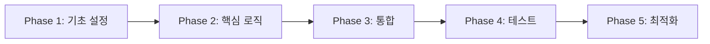

# Vibe Plan (Auto-Detection)

Vibe Coding 방법론의 **2단계: 상세 구현 계획 수립** + **AI 기반 리뷰 & 리스크 평가**.

개발자가 계획을 검토·승인하기 전까지 AI는 코드를 절대 작성하지 않는다.
**기획(의사결정)과 구현(기계적 실행)을 분리**해 아키텍처 주도권을 개발자가 유지한다.

## Enhanced Features

### 🤖 AI Review System
- 구현 계획의 완성도 자동 평가
- 누락된 고려사항 자동 감지
- 대안 접근법 제안

### ⚠️ Risk Assessment
- 위험도 자동 계산 (Low/Medium/High/Critical)
- 영향 범위 시뮬레이션
- 롤백 복잡도 예측

### 📊 Impact Analysis
- 성능 영향 예측
- 보안 취약점 사전 감지
- 기술 부채 증가 예측

### 🔄 Iterative Refinement
- 피드백 자동 통합
- 계획 버전 관리
- 승인 워크플로우 트래킹

## Activation

- `/vibe-plan` — 가장 최근 `.vibe/NNN_topic/research.md` 기반으로 계획 수립
- `/vibe-plan --research 002_foo` — 특정 토픽 폴더 지정 (`.vibe/002_foo/research.md`)
- `/vibe-plan --feedback` — 기존 plan 파일의 인라인 메모 반영 루프
- `/vibe-plan --review` — AI 기반 계획 리뷰 실행
- `/vibe-plan --risk-analysis` — 상세 리스크 분석 포함

## Workflow

### Step 0: 리서치 파일 찾기 & 분석

```bash
# 최신 리서치 파일 자동 탐지 (토픽 폴더 내부의 research.md)
LATEST_TOPIC_DIR=$(fd -t d -d 1 '^[0-9]' .vibe 2>/dev/null | sort -r | head -1)
LATEST_RESEARCH="${LATEST_TOPIC_DIR}research.md"

# 특정 리서치 지정 시: --research 002_foo → .vibe/002_foo/research.md
# SPECIFIED_RESEARCH=".vibe/${TOPIC_NAME}/research.md"

# 관련 리서치 파일들 연결 분석
rg "## 🔗 관련 리서치" .vibe/*/research.md | cut -d' ' -f3-
```

파일이 없으면: `먼저 /vibe-research "주제" 를 실행하세요.`

### Step 1: 리서치 파일 읽기 & 이해 확인

리서치 파일을 완전히 읽은 후 선언:
```
리서치 파일을 읽었습니다: .vibe/NNN_topic/research.md

📊 리서치 요약:
- 분석 파일: N개
- 영향 범위: N개 모듈
- 리스크 레벨: [Low/Medium/High]
- 핵심 발견: [발견 사항]

✅ 코드 작성은 하지 않습니다. 계획 문서만 작성합니다.
```

### Step 2: Enhanced plan.md 작성

**같은 토픽 폴더**에 plan 파일 생성: `.vibe/NNN_topic/plan.md`

research.md가 있는 토픽 폴더를 찾아서 같은 폴더에 plan.md를 저장한다.
새 토픽이면 폴더를 먼저 생성한다.

각 섹션에 `<!-- MEMO: -->` 인라인 메모 공간 및 AI 평가를 포함:

```markdown
# Plan: [주제]

**기반 리서치**: .vibe/NNN_topic/research.md
**생성일**: YYYY-MM-DD HH:MM
**상태**: DRAFT (미승인 — 구현 금지)
**승인 여부**: ☐ 미승인
**리스크 레벨**: [Low/Medium/High/Critical]
**예상 소요 시간**: [N hours/days]

---

## 📋 Plan Metadata

```yaml
version: 1.0
author: AI Assistant
reviewers: []
approval_status: pending
risk_score: 0.0
confidence_level: 0.0
```

---

## 0. 목표 & 비목표

### 목표 (Goals)
- [ ] [구체적 목표 1]
- [ ] [구체적 목표 2]
- [ ] [구체적 목표 3]

### 비목표 (Non-Goals)
- [명시적으로 제외할 사항]
- [scope creep 방지 항목]

<!-- MEMO: -->

### 📊 목표 달성 메트릭
| 메트릭 | 현재 값 | 목표 값 | 측정 방법 |
|--------|---------|---------|----------|
| 성능 | X ms | Y ms | Lighthouse |
| 커버리지 | X% | Y% | Jest |

---

## 1. 변경 파일 목록

### 1.1 신규 파일
| 파일 경로 | 목적 | 예상 라인 | 우선순위 |
|-----------|------|----------|----------|
| src/new/file.ts | 신규 기능 | ~100 | P0 |

### 1.2 수정 파일
| 파일 경로 | 변경 유형 | 영향도 | 리스크 |
|-----------|----------|--------|--------|
| src/existing/file.ts | Refactor | High | Medium |

### 1.3 삭제 파일
| 파일 경로 | 삭제 이유 | 의존성 확인 |
|-----------|----------|------------|
| src/deprecated/old.ts | 더 이상 사용 안 함 | ✅ |

<!-- MEMO: -->

---

## 2. 파일별 수정 내용

### 2.1 src/auth/login.ts

**변경 전:**
\`\`\`typescript
// 현재 코드 스니펫
function login(email: string, password: string) {
  // ...
}
\`\`\`

**변경 후:**
\`\`\`typescript
// 계획된 코드 변경
async function login(credentials: LoginCredentials): Promise<AuthResult> {
  // 개선된 로직
}
\`\`\`

**변경 이유:**
- 타입 안정성 향상
- 에러 핸들링 개선
- 비동기 처리 표준화

<!-- MEMO: -->

---

## 3. 타입/인터페이스 변경

### 3.1 Breaking Changes
\`\`\`typescript
// BEFORE
interface User {
  name: string;
}

// AFTER
interface User {
  firstName: string;  // Breaking!
  lastName: string;   // Breaking!
}
\`\`\`

### 3.2 Backward Compatible Changes
\`\`\`typescript
interface AuthOptions {
  timeout?: number;     // 신규 옵션 (optional)
  retryCount?: number;  // 신규 옵션 (optional)
}
\`\`\`

<!-- MEMO: -->

---

## 4. 구현 전략

### 4.1 구현 순서



### 4.2 Phase별 상세

#### Phase 1: 기초 설정 (30분)
- [ ] 환경 설정 파일 업데이트
- [ ] 타입 정의 추가
- [ ] 상수/설정 정의

#### Phase 2: 핵심 로직 (2시간)
- [ ] 메인 함수 구현
- [ ] 헬퍼 함수 작성
- [ ] 에러 핸들링 추가

#### Phase 3: 통합 (1시간)
- [ ] 기존 시스템과 연결
- [ ] API 엔드포인트 연동
- [ ] 상태 관리 통합

#### Phase 4: 테스트 (1시간)
- [ ] 유닛 테스트 작성
- [ ] 통합 테스트 추가
- [ ] E2E 시나리오 검증

#### Phase 5: 최적화 (30분)
- [ ] 성능 프로파일링
- [ ] 번들 사이즈 최적화
- [ ] 메모리 사용량 검토

<!-- MEMO: -->

---

## 5. 마이그레이션 & 호환성

### 5.1 마이그레이션 전략
- **Approach**: [Big Bang / Phased / Parallel Run]
- **Timeline**: [즉시 / 점진적 N주]
- **Rollback Point**: [커밋 해시 / 태그]

### 5.2 호환성 매트릭스
| 시스템 | 현재 버전 | 최소 요구 버전 | 호환성 |
|--------|----------|--------------|--------|
| Node.js | 18.x | 16.x | ✅ |
| React | 18.2 | 18.0 | ✅ |
| TypeScript | 5.0 | 4.8 | ⚠️ |

### 5.3 Breaking Change 공지
```markdown
⚠️ BREAKING CHANGES in v2.0:
- `login()` 함수 시그니처 변경
- `User` 타입 구조 변경
- 환경변수 이름 변경: OLD_VAR → NEW_VAR
```

<!-- MEMO: -->

---

## 6. 테스트 전략

### 6.1 테스트 범위
| 테스트 유형 | 현재 | 목표 | 신규 작성 |
|------------|------|------|----------|
| Unit | 65% | 85% | 15개 |
| Integration | 40% | 70% | 8개 |
| E2E | 20% | 50% | 5개 |

### 6.2 핵심 테스트 시나리오
1. **Happy Path**
   - 정상 로그인 플로우
   - 데이터 CRUD 작업
   
2. **Error Cases**
   - 네트워크 실패 처리
   - 잘못된 입력 검증
   - 권한 부족 에러

3. **Edge Cases**
   - 동시성 이슈
   - 대용량 데이터 처리
   - 타임아웃 시나리오

### 6.3 테스트 자동화
```yaml
ci-pipeline:
  - lint
  - type-check
  - unit-tests
  - integration-tests
  - e2e-tests (staging only)
```

<!-- MEMO: -->

---

## 6.5 UI/UX Design Quality (프론트엔드 변경 포함 시 자동 활성화)

> **활성화 조건**: 변경 파일 목록에 `.tsx`, `.jsx`, `.vue`, `.svelte`, `.css`, `.scss` 파일이 하나라도 있으면 이 섹션을 포함한다. 없으면 생략한다.

### Design Decisions
| 항목 | 선택 | 근거 |
|------|------|------|
| Typography | [폰트 + scale 전략] | [가독성/브랜드 부합 여부] |
| Color System | [컬러 접근법] | [대비비/접근성/브랜드 일관성] |
| Layout | [그리드/레이아웃 전략] | [반응형/콘텐츠 우선순위] |
| Motion | [모션 전략] | [목적성/성능 영향] |
| Spacing | [spacing scale] | [수직 리듬/일관성] |

### AI-Pattern Avoidance Checklist
AI가 생성한 UI는 특유의 "AI스러움"이 있다. 아래 안티패턴을 사전에 차단한다:

- [ ] **Typography**: Inter, Roboto 등 과사용 폰트 회피 → 프로젝트 맞춤 폰트 또는 distinctive 폰트 선택
- [ ] **Color**: cyan-on-dark, purple gradient 등 AI 컬러 회피 → oklch 기반 의도적 팔레트
- [ ] **Layout**: 카드-in-카드 중첩, 모든 것 center 정렬 회피 → 비대칭 + 의도적 그리드
- [ ] **Visual**: glassmorphism 남용, 장식용 sparkline 회피 → 브랜드 강화하는 의미있는 장식
- [ ] **Motion**: bounce/elastic easing 회피 → exponential easing + transform/opacity만
- [ ] **Interaction**: 모든 버튼을 primary로, 모든 상태를 badge로 회피 → 계층적 UI + progressive disclosure
- [ ] **Responsive**: 모바일에서 기능 숨기기 회피 → container queries 활용
- [ ] **UX Writing**: 이미 보이는 정보 반복 회피 → 모든 단어가 자리를 차지할 자격 검증

<!-- MEMO: -->

---

## 7. 롤백 전략

### 7.1 롤백 트리거
- [ ] 테스트 실패율 > 5%
- [ ] 에러율 증가 > 10%
- [ ] 성능 저하 > 20%
- [ ] 보안 이슈 발견

### 7.2 롤백 절차
```bash
# 1. 즉시 이전 버전으로 복원
git revert --no-commit HEAD~N..HEAD
git commit -m "Revert: [기능명] 롤백"

# 2. 핫픽스 배포 (필요시)
git cherry-pick [safe-commit]

# 3. 데이터 마이그레이션 롤백 (필요시)
npm run migration:rollback
```

### 7.3 롤백 복잡도: **[Low/Medium/High]**
- 데이터베이스 변경: [있음/없음]
- 외부 API 변경: [있음/없음]
- 설정 파일 변경: [있음/없음]

<!-- MEMO: -->

---

## 8. 대안 & 트레이드오프

### 8.1 고려된 대안

#### 대안 A: [접근법 이름]
- **장점**: 구현 간단, 빠른 배포
- **단점**: 확장성 제한, 기술 부채
- **선택 안 한 이유**: [구체적 이유]

#### 대안 B: [접근법 이름]
- **장점**: 높은 성능, 확장 가능
- **단점**: 복잡도 높음, 개발 시간 증가
- **선택 안 한 이유**: [구체적 이유]

### 8.2 트레이드오프 분석

| 요소 | 현재 접근 | 대안 A | 대안 B |
|------|----------|--------|--------|
| 개발 시간 | 3일 | 1일 | 5일 |
| 성능 | 좋음 | 보통 | 최고 |
| 유지보수성 | 높음 | 낮음 | 보통 |
| 확장성 | 높음 | 낮음 | 최고 |

<!-- MEMO: -->

---

## 9. 리스크 분석

### 9.1 리스크 매트릭스

| 리스크 | 확률 | 영향도 | 레벨 | 완화 전략 |
|--------|------|--------|------|----------|
| 성능 저하 | Medium | High | 🟡 High | 프로파일링, 점진적 롤아웃 |
| 데이터 손실 | Low | Critical | 🟡 High | 백업, 트랜잭션 처리 |
| 보안 취약점 | Low | High | 🟠 Medium | 보안 리뷰, 펜테스팅 |
| 호환성 이슈 | Medium | Medium | 🟠 Medium | 충분한 테스트, 카나리 배포 |

### 9.2 리스크 점수 계산

```
Risk Score = (확률 × 영향도 × 노출도) / 완화 수준

총 리스크 점수: 6.5/10
리스크 레벨: MEDIUM
```

### 9.3 컨틴전시 플랜
1. **Plan A** (Primary): 정상 구현 진행
2. **Plan B** (Fallback): 범위 축소하여 핵심 기능만
3. **Plan C** (Emergency): 기존 시스템 유지, 재설계

<!-- MEMO: -->

---

## 10. 핵심 의사결정 질문

### 필수 결정 사항 ⚠️
- [ ] **Q1**: 동기 vs 비동기 처리 방식?
  - **A**: [결정 대기 중]
  
- [ ] **Q2**: 에러 처리 전략 (throw vs return)?
  - **A**: [결정 대기 중]
  
- [ ] **Q3**: 캐싱 전략 (메모리 vs Redis)?
  - **A**: [결정 대기 중]

### 선택적 고려사항
- [ ] 로깅 레벨 설정?
- [ ] 모니터링 메트릭 추가?
- [ ] A/B 테스트 필요?

<!-- MEMO: -->

---

## 11. AI Review Report

### 11.1 자동 평가 결과

**점수 산출 기준 (각 항목 10점, 총 100점):**

| 평가 항목 | 기준 | 배점 |
|-----------|------|------|
| 목표 명확성 | Goals/Non-goals가 구체적이고 측정 가능한가? | 10 |
| 파일 변경 완성도 | 모든 변경 파일이 경로/변경유형과 함께 명시되었는가? | 10 |
| 코드 변경 상세도 | Before/After 코드 스니펫이 주요 변경마다 포함되었는가? | 10 |
| 타입 안전성 | Breaking changes가 명확히 표시되고 마이그레이션 방안이 있는가? | 10 |
| 구현 순서 | 의존성 기반 Phase별 순서가 정의되었는가? | 10 |
| 테스트 전략 | 테스트 유형별 커버리지 목표와 시나리오가 있는가? | 10 |
| 롤백 전략 | 트리거 조건, 절차, 복잡도가 정의되었는가? | 10 |
| 리스크 분석 | 리스크 매트릭스와 완화 전략이 있는가? | 10 |
| 보안 고려 | 보안 관련 변경사항이 검토되었는가? | 10 |
| 의사결정 완료 | 핵심 질문이 모두 답변되었는가? | 10 |

**점수 산출 방법:** 각 항목을 Yes(10)/Partial(5)/No(0)로 평가 후 합산.

```yaml
완성도 점수: [합산 점수]/100
평가 상세:
  목표 명확성: [10/5/0] - [근거]
  파일 변경 완성도: [10/5/0] - [근거]
  코드 변경 상세도: [10/5/0] - [근거]
  # ... 나머지 항목

누락 요소:
  - [점수 0인 항목 나열]

강점:
  - [점수 10인 항목 나열]
```

### 11.2 개선 제안

1. **보안 강화**
   - Input validation 레이어 추가
   - Rate limiting 구현 명시
   - 보안 헤더 설정 포함

2. **성능 최적화**
   - 목표 응답 시간 명시 (p50, p95, p99)
   - 캐싱 전략 구체화
   - 데이터베이스 인덱스 계획

3. **관찰 가능성**
   - 로깅 전략 추가
   - 메트릭 수집 계획
   - 분산 추적 고려

### 11.3 대안 접근법

**AI 추천 대안**:
```
현재 계획의 동기 처리 대신 이벤트 드리븐 아키텍처 고려:
- 확장성 30% 향상 예상
- 복잡도 20% 증가
- 개발 시간 1.5배
```

---

## 승인 체크리스트

### 기술 검토
- [ ] research.md 최신화 완료
- [ ] 목표/비목표 명시 완료
- [ ] 변경 파일 경로 확정
- [ ] 타입/인터페이스 변경 검토
- [ ] 테스트 전략 확정
- [ ] 롤백 전략 확정

### 비즈니스 검토
- [ ] 요구사항 충족 확인
- [ ] 일정 타당성 검토
- [ ] 리소스 할당 확인

### AI 검토
- [ ] 자동 리뷰 통과 (점수 > 80)
- [ ] 리스크 레벨 수용 가능
- [ ] 핵심 의사결정 모두 응답

### 최종 승인
- [ ] **기술 리드 승인**: ☐
- [ ] **프로덕트 오너 승인**: ☐
- [ ] **개발자 최종 승인**: ☐

**승인 시각**: [YYYY-MM-DD HH:MM]
**승인자**: [이름]
**승인 코멘트**: [선택사항]

---

## 실행 명령

승인 완료 후 다음 명령으로 구현 시작:
```bash
/vibe-implement --plan NNN_topic
```

vibe-implement는 `.vibe/NNN_topic/plan.md`를 자동으로 찾습니다.
미승인 상태에서는 구현이 차단됩니다.
```

## Advanced Features

### --review 모드
AI가 계획을 자동으로 검토하고 개선점을 제안:
```bash
/vibe-plan --review

# 출력:
✅ 강점: 명확한 목표, 상세한 테스트 계획
⚠️ 개선 필요: 보안 고려사항, 성능 메트릭
💡 제안: 캐싱 전략 추가, 모니터링 계획 수립
```

### --risk-analysis 모드
상세한 리스크 분석 및 시뮬레이션:
```bash
/vibe-plan --risk-analysis

# 출력:
리스크 시뮬레이션 결과:
- 최악 시나리오: 3일 지연, 롤백 필요
- 최선 시나리오: 예정대로 완료
- 가능성 높은 시나리오: 1일 지연, 부분 기능 제외
```

### 피드백 루프 (`--feedback` 모드)
`<!-- MEMO: 개발자 코멘트 -->` 섹션의 모든 메모를 추출해 plan.md를 자동 업데이트.

## Critical Rules

**절대 금지 사항:**
- 코드 작성 (사용자 명시적 승인 전까지)
- 승인 없이 "구현을 시작합니다" 선언
- 중요한 결정을 사용자 확인 없이 임의 결정
- 리스크 레벨 HIGH 이상을 경고 없이 진행

**필수 준수 사항:**
- 모든 섹션에 `<!-- MEMO: -->` 인라인 메모 공간 포함
- 핵심 의사결정은 반드시 사용자에게 질문
- 리스크 점수 7/10 이상은 명시적 경고
- Breaking changes는 명확히 표시
- 롤백 전략은 항상 포함
- AI 리뷰 점수 80점 미만은 재작성 권고

**성공 지표:**
- 계획 완성도 > 85%
- 리스크 레벨 ≤ MEDIUM
- 모든 핵심 질문 답변 완료
- 승인자 체크리스트 100% 완료