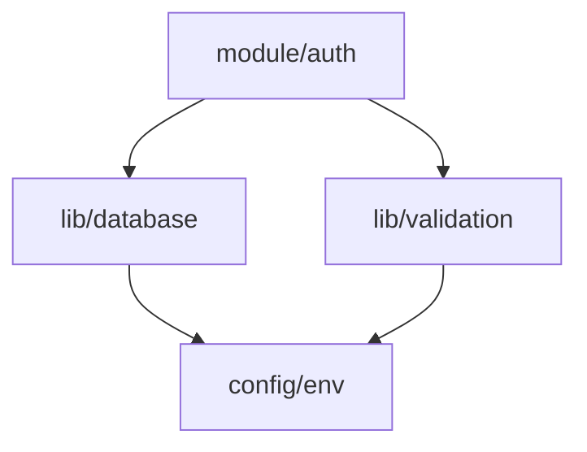

# Vibe Research (Auto-Detection)

Vibe Coding 방법론의 **1단계: 심층 리서치** - 요청 내용에 따라 자동으로 필요한 분석 모드를 활성화합니다.

코드를 절대 작성하지 않고, 관련 코드베이스를 깊이 분석해 재사용 가능한 research 문서를 생성한다.
채팅으로 소비되는 정보가 아니라 **프로젝트 내 공유 문서**로 축적한다.

## 🤖 Auto-Detection System

사용자 요청에 포함된 키워드를 자동으로 감지하여 적절한 옵션을 활성화합니다:

### 자동 옵션 활성화 규칙

| 키워드 감지 | 자동 활성화 | 분석 내용 |
|------------|------------|----------|
| "성능", "느림", "속도", "최적화", "메모리" | `--deep` | 성능 프로파일링, 복잡도 분석 |
| "깊은", "상세", "심층", "디테일", "프로파일" | `--deep` | 깊이 있는 분석 |
| "패턴", "중복", "리팩토링", "코드 품질", "안티패턴" | `--patterns` | 코드 패턴 분석 |
| "정리", "개선", "스멜", "SOLID" | `--patterns` | 코드 품질 체크 |
| "의존성", "구조", "관계", "연결", "모듈" | `--graph` | 의존성 그래프 |
| "영향", "파급", "순환", "시각화" | `--graph` | 구조 시각화 |
| "전체", "종합", "완전", "모든" | 모든 옵션 | 전체 분석 |
| "버그", "오류", "문제", "이슈" | `--deep` + `--patterns` | 버그 원인 분석 |

### 사용 예시

```bash
# "성능"이 포함되면 --deep 자동 활성화
/vibe-research "로그인 성능 분석"
→ 자동으로 --deep 활성화

# "의존성"이 포함되면 --graph 자동 활성화
/vibe-research "모듈 간 의존성 확인"
→ 자동으로 --graph 활성화

# "전체"가 포함되면 모든 옵션 활성화
/vibe-research "인증 시스템 전체 분석"
→ 자동으로 --deep --patterns --graph 활성화
```

## Enhanced Features

### 🔍 Pattern Detection
- 코드 중복 패턴 자동 감지
- 안티패턴 식별 및 리포팅
- 베스트 프랙티스 준수 여부 체크

### 📊 Dependency Graph
- 모듈 간 의존성 시각화 (mermaid diagram)
- 순환 참조 감지
- 파급 영향 범위 자동 계산

### 🎯 Smart Indexing
- 자동 인덱스 번호 관리
- 관련 리서치 문서 자동 링크
- 태그 기반 분류 시스템

## Workflow

### Step 0: .vibe 디렉토리 준비 및 인덱싱

```bash
# .vibe/ 디렉토리 없으면 생성
mkdir -p .vibe

# 다음 인덱스 번호 자동 계산 (기존 파일 수 + 1, 001부터 시작)
NEXT_INDEX=$(printf "%03d" $(($(ls .vibe/*.md 2>/dev/null | wc -l) + 1)))

# 기존 리서치 문서 태그 분석
grep -h "^#tags:" .vibe/*.md 2>/dev/null | sort | uniq
```

파일명 규칙: `.vibe/NNN_topic_in_english_snake_case.md`

### Step 1: 분석 범위 선언 및 자동 모드 설정

사용자 요청을 분석하여 자동으로 옵션을 활성화하고 선언:
```
리서치를 시작합니다. 코드 작성 없이 분석만 진행합니다.

📋 주제: [사용자 입력 주제]
📁 산출물: .vibe/NNN_topic.md

🤖 자동 감지된 분석 모드:
  - [x] 기본 분석 (코드 구조, 플로우, 의존성)
  - [자동] --deep: ["성능" 키워드 감지시 활성화]
  - [자동] --patterns: ["패턴" 또는 "리팩토링" 감지시 활성화]
  - [자동] --graph: ["의존성" 또는 "구조" 감지시 활성화]

💡 감지된 키워드: [키워드 목록]
✅ 활성화된 옵션: [옵션 목록]
```

### Step 2: 심층 코드베이스 분석 (Enhanced)

#### 2.1 기본 분석 (필수)
- 관련 파일/함수/타입 전체 맵 (정확한 경로 포함)
- 현재 동작 플로우 (트리거 → 처리 → 출력)
- 데이터 플로우 (입력/변환/출력/외부연동)
- 의존성 & 사이드이펙트
- 리스크 & 파급 범위
- 불확실성 목록 (사용자 확인 필요 항목)

#### 2.2 패턴 분석 (--patterns)
```bash
# 코드 중복 감지
ast-grep -p 'function $NAME($$$) { $$$ }' --lang tsx | \
  awk '{print $2}' | sort | uniq -c | sort -rn

# 안티패턴 스캔
rg "console\.(log|error)" --type ts --count
rg "any" --type ts -A 2 -B 2 | grep -E "(: any|as any)"
```

#### 2.3 의존성 그래프 (--graph)


#### 2.4 성능 프로파일링 (--deep)
- Big O 복잡도 분석
- 잠재적 메모리 누수 지점
- N+1 쿼리 패턴 감지
- 불필요한 리렌더링 포인트 (React)

### Step 3: Enhanced research.md 작성

**중요: 요약하지 않는다. 매우 상세하게 작성한다.**

파일 구조:
```markdown
# Research: [주제]

**생성일**: YYYY-MM-DD HH:MM
**인덱스**: NNN
**상태**: research-only (코드 변경 없음)
**분석 모드**: [기본 | deep | patterns | graph]
**태그**: #auth #performance #refactoring

---

## 🔗 관련 리서치
- [001_authentication.md](001_authentication.md) - 인증 시스템 분석
- [005_database_layer.md](005_database_layer.md) - DB 레이어 분석

---

## 1. 관련 파일/함수/타입 맵

### 1.1 핵심 파일
| 파일 경로 | 역할 | 복잡도 | 변경 위험도 |
|-----------|------|--------|------------|
| src/auth/login.ts:45-120 | 로그인 로직 | Medium | High |
| src/auth/session.ts:12-89 | 세션 관리 | Low | Medium |

### 1.2 타입 정의
\`\`\`typescript
// src/types/auth.ts:15-25
interface AuthContext {
  user: User | null;
  login: (credentials: LoginCredentials) => Promise<void>;
  logout: () => void;
}
\`\`\`

## 2. 현재 동작 플로우

\`\`\`mermaid
sequenceDiagram
    participant User
    participant LoginForm
    participant AuthAPI
    participant Database
    
    User->>LoginForm: 입력
    LoginForm->>AuthAPI: POST /api/auth/login
    AuthAPI->>Database: 검증
    Database-->>AuthAPI: 결과
    AuthAPI-->>LoginForm: 토큰/에러
    LoginForm-->>User: 리다이렉트/에러표시
\`\`\`

## 3. 데이터 플로우

### 3.1 입력 데이터
- 소스: 로그인 폼 (email, password)
- 검증: zod 스키마 (src/schemas/auth.ts:10)
- 변환: bcrypt 해싱 (src/lib/crypto.ts:25)

### 3.2 상태 관리
- Context: AuthContext (src/contexts/auth.tsx)
- Storage: localStorage (토큰), sessionStorage (임시 데이터)
- Cookie: httpOnly secure cookie (프로덕션)

## 4. 의존성 & 사이드이펙트

### 4.1 의존성 그래프
\`\`\`mermaid
graph LR
    auth/login --> lib/validation
    auth/login --> lib/crypto
    auth/login --> api/client
    auth/session --> lib/storage
    auth/session --> contexts/auth
\`\`\`

### 4.2 사이드이펙트
- localStorage 쓰기 (토큰 저장)
- 네트워크 요청 (API 호출)
- 라우터 네비게이션 (성공 시 리다이렉트)

## 5. 코드 패턴 분석

### 5.1 발견된 패턴
| 패턴 | 위치 | 빈도 | 권장사항 |
|------|------|------|----------|
| try-catch 없는 async | 5개 파일 | 12회 | 에러 핸들링 추가 |
| console.log | 3개 파일 | 8회 | 프로덕션 제거 |
| any 타입 | 2개 파일 | 3회 | 구체적 타입 정의 |

### 5.2 안티패턴
- ❌ src/auth/login.ts:67 - 비밀번호 평문 로깅
- ❌ src/api/client.ts:45 - 에러 무시 (catch 블록 비움)
- ⚠️ src/contexts/auth.tsx:89 - 불필요한 리렌더링

## 6. 성능 분석

### 6.1 복잡도
| 함수 | 시간 복잡도 | 공간 복잡도 | 최적화 가능 |
|------|------------|------------|-------------|
| validateCredentials | O(n) | O(1) | No |
| findUserByEmail | O(n) | O(1) | Yes - 인덱싱 |
| generateToken | O(1) | O(1) | No |

### 6.2 잠재적 병목
- DB 쿼리: email로 사용자 찾기 (인덱스 없음)
- bcrypt rounds: 12 (조정 검토 필요)

## 7. 리스크 & 파급 범위

### 7.1 보안 리스크
| 리스크 | 심각도 | 영향 범위 | 조치 필요 |
|--------|--------|----------|-----------|
| XSS 취약점 | High | 로그인 폼 | 입력 sanitize |
| 토큰 노출 | Medium | localStorage | httpOnly cookie |
| Rate limiting 없음 | Medium | API | 제한 추가 |

### 7.2 변경 파급 범위
- 인증 로직 변경 시: 15개 컴포넌트 영향
- 세션 관리 변경 시: 8개 페이지 영향
- API 엔드포인트 변경 시: 3개 클라이언트 영향

## 8. 불확실성 & 확인 필요 항목

### 필수 확인
- [ ] 토큰 만료 시간 정책? (현재 24시간)
- [ ] 동시 로그인 세션 허용 여부?
- [ ] 2FA 구현 계획?

### 선택 확인
- [ ] OAuth 제공자 추가 계획? (Google, GitHub)
- [ ] 비밀번호 정책 강화 필요?
- [ ] 로그인 실패 시 계정 잠금 정책?

## 9. 관련 문서 & 리소스

- [OWASP Authentication Cheatsheet](https://cheatsheetseries.owasp.org/cheatsheets/Authentication_Cheat_Sheet.html)
- [JWT Best Practices](https://datatracker.ietf.org/doc/html/rfc8725)
- 내부 문서: [Security Guidelines](./docs/security.md)

## 10. 메트릭스 & 통계

```yaml
분석 범위:
  파일 수: 12
  총 라인: 1,847
  함수 수: 34
  타입 정의: 18

코드 품질:
  테스트 커버리지: 67%
  TypeScript strict: false
  ESLint 오류: 23
  ESLint 경고: 45

복잡도:
  평균 Cyclomatic: 4.2
  최대 Cyclomatic: 12 (validateAndLogin 함수)
  중복 코드: 15%
```

## 11. 요약 & 다음 단계

### 핵심 발견
1. 인증 시스템은 기본 기능은 동작하나 보안 강화 필요
2. 에러 핸들링 일관성 부족
3. 성능 최적화 기회 다수 존재

### 즉시 조치 필요
- 비밀번호 평문 로깅 제거
- XSS 취약점 패치
- Rate limiting 구현

### 다음 단계
**`/vibe-plan`** 으로 구현 계획 수립
- 보안 강화 우선
- 성능 최적화는 2차
- 테스트 커버리지 80% 목표

---

## 태그
#auth #security #performance #refactoring #high-priority

## 버전 히스토리
- v1.0 (YYYY-MM-DD): 초기 분석 완료
```

## Critical Rules

**절대 금지 사항:**
- 코드 작성 (신규 파일, 기존 파일 수정 모두 금지)
- 얕은 요약 (파일 경로/함수명 없는 일반적 설명)
- 추측 기반 작성 (실제 코드를 읽지 않은 내용)

**필수 준수 사항:**
- 모든 참조는 `파일경로:라인번호` 형식
- 불확실한 부분은 숨기지 말고 명시
- 인덱스 번호는 항상 3자리 (001, 002, ...)
- 메트릭스와 통계 데이터 포함
- 시각적 다이어그램 활용 (mermaid)
- 태그 시스템으로 분류

**향상된 분석 도구 활용:**
- `ast-grep`: 구조적 코드 패턴 검색
- `rg` (ripgrep): 고속 텍스트 검색
- `fd`: 파일 탐색
- `tokei`: 코드 통계 생성
- `complexity`: 복잡도 분석